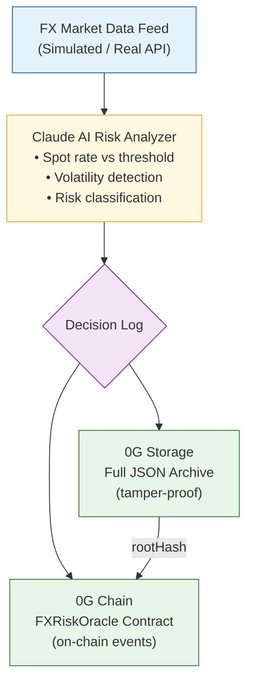

# FX Risk Agent

> AI-powered Foreign Exchange Risk Monitoring Agent with on-chain audit trail via 0G Network

## Overview

**FX Risk Agent** is an autonomous AI agent that monitors foreign exchange markets, detects risk events, and creates an immutable, auditable trail of every decision on the 0G blockchain.

Built for cross-border payment companies that need to manage FX exposure during settlement windows (T+0 to T+2), this agent combines:

- **Claude AI** for intelligent risk assessment
- **0G Storage** for permanent, decentralized decision log archival
- **0G Chain** for on-chain risk event recording

### The Problem

Cross-border payment companies process billions in daily FX transactions. When exchange rates move sharply:
- Manual monitoring misses critical windows
- Decision trails are scattered across emails, chats, and spreadsheets
- Post-incident audits lack verifiable evidence of what was known and when

### The Solution

FX Risk Agent automates the entire risk monitoring pipeline with **verifiable AI decisions**:

```
FX Market Data → Claude AI Analysis → Decision Log (0G Storage) → Risk Alert (0G Chain)
```

Every AI decision is:
1. **Permanently stored** on 0G Storage (tamper-proof)
2. **Recorded on-chain** with the storage root hash (auditable)
3. **Queryable** by currency pair, risk level, and time range

## Architecture



## 0G Components Used

| Component | Usage |
|-----------|-------|
| **0G Storage** | Stores full AI decision logs (JSON) with merkle root hash |
| **0G Chain** | FXRiskOracle smart contract records risk alerts on-chain |

## Tech Stack

- **Language**: TypeScript + Solidity
- **AI**: Claude API (Anthropic)
- **Smart Contract**: Solidity 0.8.24, Foundry
- **0G SDK**: `@0gfoundation/0g-ts-sdk`
- **Network**: 0G Galileo Testnet (Chain ID: 16602)

## Quick Start

```bash
# Install TypeScript dependencies
npm install

# Copy and configure environment
cp .env.example .env
# Edit .env: add PRIVATE_KEY and ANTHROPIC_API_KEY

# Compile smart contract (requires Foundry)
forge build

# Deploy to 0G Galileo Testnet
source .env && forge script script/Deploy.s.sol \
  --rpc-url $OG_RPC_URL --broadcast --private-key $PRIVATE_KEY

# Run the AI agent
npm run agent
```

## Smart Contract

**FXRiskOracle** (`contracts/FXRiskOracle.sol`):
- `submitAlert()` — Record a risk alert with 0G Storage root hash
- `getLatestAlerts()` — Query recent alerts
- `latestRiskLevel()` — Get current risk level per currency pair

## Risk Levels

| Level | Description |
|-------|-------------|
| LOW | Rate within normal range |
| MEDIUM | Rate approaching threshold (within 30%) |
| HIGH | Threshold breached or volatility spike |
| CRITICAL | Multiple indicators triggered |

## Currency Pairs Monitored

- USD/CNY — Cross-border RMB payments
- EUR/USD — European trade settlements
- GBP/USD — UK corridor
- USD/JPY — Japan corridor

## Roadmap

- [x] MVP: AI analysis + 0G Storage + on-chain alerts
- [ ] Real FX data feed integration (Alpha Vantage / Twelve Data)
- [ ] TEE Sealed Inference for strategy privacy (0G Compute)
- [ ] Multi-agent collaboration (separate agents per currency corridor)
- [ ] Web dashboard for risk monitoring

## About

Built by [@0xSmallironman](https://x.com/0xSmallironman) for the [0G APAC Hackathon](https://www.hackquest.io/hackathons/0G-APAC-Hackathon).

*"From SWIFT to Smart Contracts" — Bringing 5 years of cross-border payment infrastructure experience to Web3.*

## License

MIT
