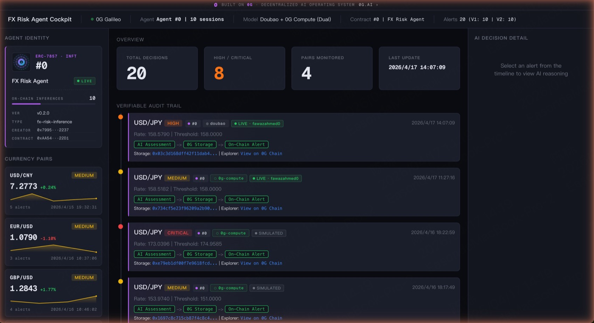
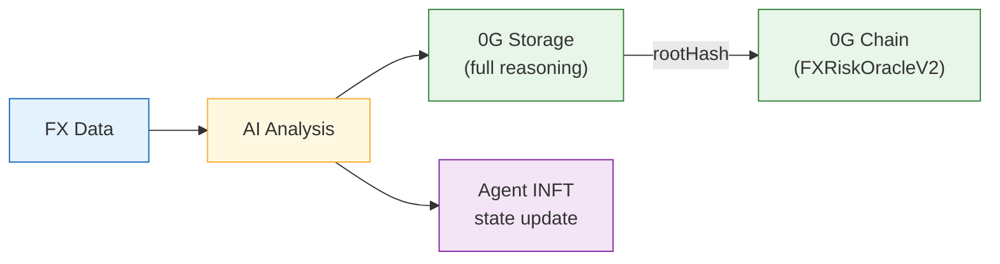
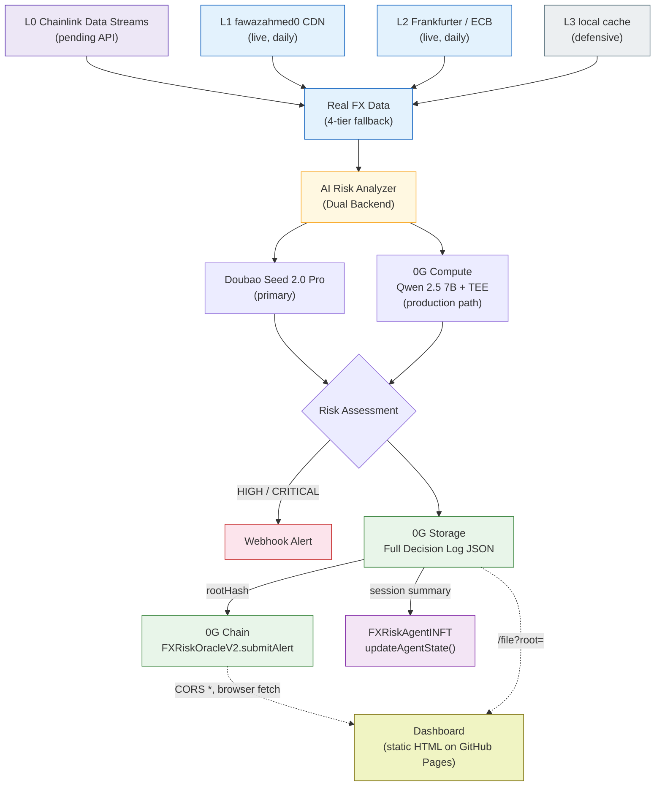

<p align="right">
  <b>English</b> | <a href="./README.zh-CN.md">中文</a>
</p>

# FX Risk Agent

> A verifiable AI-powered FX risk monitoring agent on 0G Network — every decision permanently stored, on-chain recorded, **fetched directly from decentralized storage in the browser**.

<p align="center">
  <a href="https://youtu.be/j2eaoJN18a8">
    
  </a>
  <a href="https://smallironman666.github.io/fx-risk-agent/">
    
  </a>
  <a href="https://chainscan-galileo.0g.ai/address/0x2abde2687923ffb9a5be4c6df3aac68a4f0a93ca">
    
  </a>
  <a href="https://github.com/smallironman666/fx-risk-agent/actions/workflows/ci.yml">
    
  </a>
</p>

## Live Demo

[](https://smallironman666.github.io/fx-risk-agent/)

- **Dashboard**: https://smallironman666.github.io/fx-risk-agent/ *(static site, fetches data directly from 0G Storage)*
- **Demo Video**: [Watch on YouTube (2:37)](https://youtu.be/j2eaoJN18a8)

**On-Chain Contracts (0G Galileo Testnet, Chain ID 16602):**

| Contract | Address | Role |
|---|---|---|
| **FXRiskOracleV2** | [`0x2abde2687923ffb9a5be4c6df3aac68a4f0a93ca`](https://chainscan-galileo.0g.ai/address/0x2abde2687923ffb9a5be4c6df3aac68a4f0a93ca) | Primary oracle with Agent ID linkage + access control |
| **FXRiskAgentINFT** | [`0xAA540f42f0d20588f183E3B92B3b617991fa22D1`](https://chainscan-galileo.0g.ai/address/0xAA540f42f0d20588f183E3B92B3b617991fa22D1) | Agent identity (ERC-7857 inspired INFT) — Ownable + ReentrancyGuard |
| **FXRiskOracle V1** | [`0x12030bc39dd18E2e8e4F10e685b7B7E639F0925A`](https://chainscan-galileo.0g.ai/address/0x12030bc39dd18E2e8e4F10e685b7B7E639F0925A) | Legacy (historical audit trail) |

## Problem

Cross-border payment companies process billions in FX transactions every day. Common risk patterns:

- **Currency pair inversion** — Upstream rate sources occasionally return inverted pairs (USD/X vs X/USD), potentially producing 100x+ pricing errors
- **Rate source outage** — External feed disruptions cause FX quote generation to fail, impacting customer transactions
- **No audit trail** — After incidents, teams can't reconstruct what the AI knew, when it knew it, and what decisions were made

Manual monitoring misses critical windows. Decision trails are scattered across emails and spreadsheets. Post-incident audits lack verifiable evidence.

**The deeper gap**: "AI makes decisions" and "AI decisions are auditable" are worlds apart. Most AI systems today produce outputs with no cryptographic trail.

## Solution

FX Risk Agent closes that gap. It's an autonomous AI agent that **monitors, judges, records, and alerts** — with every decision permanently verifiable on the 0G Network.



**Core value proposition:**
1. **AI cuts noise** — Not threshold alerts that fire 100x/day. AI understands market context, only escalates when it matters.
2. **Structured audit trail** — Every decision (including "no risk" judgments) is permanently stored with full reasoning on 0G Storage.
3. **On-chain proof** — Risk alerts recorded on-chain with Storage rootHash. Anyone can verify: chain record → fetch full AI decision log from 0G Storage → check reasoning.

## Key Features

- **Real FX Data (4-tier fallback)** — L0 Chainlink Data Streams (sub-second, event-driven, pending API access) → L1 fawazahmed0 CDN (daily, live) → L2 Frankfurter / ECB (daily, live) → L3 local cache. Dragon (0G APAC DevRel Lead) confirmed Data Streams is "the correct choice for this event-driven FX risk scenario."
- **18 Currency Pairs** monitored — G10 majors (EUR/USD, GBP/USD, USD/JPY, AUD/USD, USD/CAD, USD/CHF) + APAC corridors (USD/CNY, USD/HKD, USD/SGD, USD/KRW, USD/INR, USD/MYR, USD/PHP, USD/THB, USD/IDR, USD/TWD, USD/VND) + Americas (USD/MXN). Covers the major cross-border payment corridors.
- **Historical Replay + Risk Heatmap** — Time-machine slider lets auditors rewind to any moment. Risk Map view visualizes all 18 pairs' risk level simultaneously. Auto-play mode animates the risk landscape over time. Aligned with EU AI Act Article 12 "replayable decisions" requirement.
- **Data source badges** — every alert card lazily displays its FX data provenance (LIVE · fawazahmed0 / ECB / cached / SIMULATED), loaded from 0G Storage rather than a centralized API.

## Architecture



## Why 0G?

| 0G Component | Status | What We Use It For | On-chain Proof |
|---|---|---|---|
| **0G Storage** | Live | Permanent archive of full AI decision logs (JSON with reasoning) — tamper-proof audit trail | Every alert's `storageRootHash` field, resolvable via indexer API |
| **0G Chain** | Live | `FXRiskOracleV2` records alerts with `agentTokenId` + `aiBackend` fields; V1 preserved for audit continuity | [FXRiskOracleV2 contract](https://chainscan-galileo.0g.ai/address/0x2abde2687923ffb9a5be4c6df3aac68a4f0a93ca) |
| **0G Compute** | Live | Dual-backend inference via `@0glabs/0g-serving-broker`. 0G Compute (Qwen 2.5 7B + TEE) as primary, Doubao as graceful fallback. | Alerts with `aiBackend="0g-compute"` — on-chain settled via ledger + inference modules, TEE-attested |
| **Agent ID (ERC-7857 INFT)** | Live | `FXRiskAgentINFT` tokenizes agent identity. Every session calls `updateAgentState()` incrementing on-chain `inferenceCount`. | [Token #0 on INFT contract](https://chainscan-galileo.0g.ai/address/0xAA540f42f0d20588f183E3B92B3b617991fa22D1) |

**Not integrated** (by design, see [ADR-004](./docs/adr/004-skip-tee-privacy.md)): Privacy / Secure Execution. Our use case is audit/transparency, not confidentiality.

## 0G Integration Verification

Anyone can independently verify that the Dashboard's data actually lives on 0G Storage:

```bash
# 1. Pick any on-chain alert from the Chain Explorer
https://chainscan-galileo.0g.ai/address/0x2abde2687923ffb9a5be4c6df3aac68a4f0a93ca

# 2. Extract its storageRootHash field, e.g.
ROOT=0xfec46db02f1313e3b0e6c9833985ae83387f9eeb0f916ca88a8276d63da75842

# 3. Check it's finalized on 0G Storage (indexer metadata)
curl "https://indexer-storage-testnet-turbo.0g.ai/file/info/$ROOT"
# → { "code": 0, "data": { "finalized": true, "size": 5399, ... } }

# 4. Download the full AI decision log (same bytes the Dashboard fetches)
curl "https://indexer-storage-testnet-turbo.0g.ai/file?root=$ROOT"
# → Full JSON with AI reasoning, confidence, recommendation, TEE verification...
```

The Dashboard does exactly this in the browser — CORS is open (`Access-Control-Allow-Origin: *`), no backend required.

## Security Architecture

Two deliberate design decisions close the trust boundary at both ends:

**Access control — `onlyOwner` mint + `ownerOf` submission:**
- Minting a new Agent INFT requires `onlyOwner` on the NFT contract
- Submitting an alert on behalf of Agent #N requires `INFT.ownerOf(N) == msg.sender`
- Result: no permissionless path lets an attacker forge "official" AI alerts

**Reentrancy protection on state mutations:**
- `mintAgent` and `updateAgentState` both inherit OpenZeppelin's `ReentrancyGuard`
- `mintAgent` writes metadata **before** the external `_safeMint` call — malicious `ERC721Receiver` can't observe half-written state

Both contracts use OpenZeppelin 5.6.1 battle-tested primitives (`Ownable`, `ReentrancyGuard`, `ERC721`). No custom access-control rolling.

## Dashboard Architecture (Static + Truly Decentralized)

The Dashboard is a **single static HTML file on GitHub Pages** with no backend. When you click "View AI Decision":

1. Browser `fetch`'s `https://indexer-storage-testnet-turbo.0g.ai/file?root={rootHash}` directly
2. 0G's indexer serves the identical bytes that were uploaded on-chain
3. A local mirror in `frontend/data/` acts as graceful fallback only

This is what "Web3 frontend" looks like when it's not just aesthetic: **no proxy, no middleman, no trusted API**. Any user can verify the same URL with `curl` and get the same bytes.

## Tech Stack

| Layer | Technology | Notes |
|---|---|---|
| AI Inference | **Dual Backend**: Doubao Seed 2.0 Pro + 0G Compute (Qwen 2.5 7B, TEE) | Auto-fallback with `fallbackReason` recorded on-chain |
| Smart Contracts | Solidity 0.8.24 + OpenZeppelin 5.6.1 | Compiled & tested with Foundry |
| 0G SDKs | `@0gfoundation/0g-ts-sdk`, `@0glabs/0g-serving-broker` | Storage upload + verifiable inference |
| Chain | 0G Galileo Testnet (Chain ID 16602) | EVM-compatible |
| Frontend | Vanilla HTML + ethers.js | **Fetches decision logs directly from 0G Storage** (no backend) |
| Language | TypeScript | End-to-end |

## Quick Start

```bash
# Install dependencies
npm install

# Copy and configure environment
cp .env.example .env
# Edit .env: add PRIVATE_KEY, AI_API_KEY (Doubao)

# Compile smart contracts (requires Foundry)
forge build

# Deploy INFT first, then Oracle V2 (Oracle depends on INFT address)
source .env && forge script script/DeployAgentINFT.s.sol \
  --rpc-url $OG_RPC_URL --broadcast --private-key $PRIVATE_KEY \
  --legacy --with-gas-price 3000000000

# Mint Token #0 (run once)
npx ts-node src/tools/mintAgent.ts

# Deploy Oracle V2
source .env && forge script script/DeployOracleV2.s.sol \
  --rpc-url $OG_RPC_URL --broadcast --private-key $PRIVATE_KEY \
  --legacy --with-gas-price 3000000000

# Run the agent
npm run agent                                              # default backend
AI_BACKEND=0g-compute npm run agent                        # verifiable inference via 0G Compute
npx ts-node src/index.ts --pair USD/CNY --scenario crisis  # specific scenario

# Bootstrap 0G Compute (one-time, costs ~4 OG)
npm run bootstrap-compute

# Fetch any decision log from 0G Storage by rootHash
npx ts-node src/tools/fetchLog.ts 0xfec46db02f1313e3b0e6c9833985ae83387f9eeb0f916ca88a8276d63da75842
```

## Currency Pairs Monitored

| Pair | Corridor | Upper Bound | Lower Bound |
|---|---|---|---|
| USD/CNY | Cross-border RMB | 7.35 | 7.15 |
| EUR/USD | European settlements | 1.12 | 1.04 |
| GBP/USD | UK corridor | 1.30 | 1.22 |
| USD/JPY | Japan corridor | 158.0 | 148.0 |

## Risk Levels

| Level | Trigger | Action |
|---|---|---|
| LOW | Rate within normal range | Logged for audit |
| MEDIUM | Approaching threshold (within 30%) | Logged + increased monitoring |
| HIGH | Threshold breached or volatility spike | **Webhook alert to operations** |
| CRITICAL | Multiple indicators triggered | **Immediate alert + escalation** |

## Roadmap

- [x] AI risk analysis with verifiable decision logs
- [x] 0G Storage integration (permanent audit trail)
- [x] On-chain alert recording (FXRiskOracle V1 + V2)
- [x] **0G Compute integration** (dual-backend with TEE verification + automatic fallback)
- [x] **Agent ID (ERC-7857 INFT)** with on-chain `inferenceCount`
- [x] Contract-level security (Ownable + ReentrancyGuard + access-controlled alerts)
- [x] Dashboard with direct-from-0G-Storage decision log viewer
- [x] Webhook alerting for HIGH/CRITICAL events
- [x] CLI tool to fetch full AI decision log by rootHash
- [x] **Real FX data feed (3-tier live + L0 Chainlink ready)** — fawazahmed0 CDN + Frankfurter/ECB + local cache; L0 Chainlink Data Streams integrated at the code level, awaiting API credentials
- [x] **18 currency pairs** covering major cross-border payment corridors (G10 + APAC + LATAM)
- [x] **Historical Replay + Risk Heatmap** — Time-machine slider, risk landscape view across all pairs, auto-play mode (EU AI Act Article 12 alignment)
- [ ] INFT `tokenURI` — wallet/explorer-renderable Agent metadata (scheduled with mainnet migration)
- [ ] Mainnet migration to 0G Aristotle (Chain ID 16661)
- [ ] Activate L0 Chainlink Data Streams once API access is granted
- [ ] Mainnet deployment (0G Aristotle, Chain ID 16661)
- [ ] Multi-agent collaboration per currency corridor

## Agent ID (ERC-7857 INFT)

The agent has a **first-class, accountable on-chain identity** — not just metadata, but a tokenized AI asset:

```
FXRiskAgentINFT: 0xAA540f42f0d20588f183E3B92B3b617991fa22D1
Agent Token ID : #0
Name           : "FX Risk Agent"
Version        : v0.2.0
Model Type     : fx-risk-inference
Storage Root   : 0xd5f125f770c7cef63e5a2316e037177340d2ace54b767b1c77124b219fefc517
                 (points to full metadata JSON on 0G Storage)
```

**Every session updates on-chain state**:
- Session summary (processed pairs, decision log hashes) uploaded to 0G Storage
- `updateAgentState(tokenId, sessionRootHash)` called on INFT
- `inferenceCount` increments — provable history of agent activity

**Every V2 alert is cryptographically linked to the Agent ID**:
```solidity
submitAlert(pair, level, rate, threshold, rootHash, agentTokenId, aiBackend)
// Requires: INFT.ownerOf(agentTokenId) == msg.sender
```

**Why this matters**:
- **Accountability**: Every decision traceable to a specific agent version with a signed system prompt
- **Tradeability**: The INFT can be transferred/licensed — Memory *is* an asset
- **Auditability**: Regulators can query `getAgent(tokenId)` for full provenance

## Dual AI Backend

Switch backends via `AI_BACKEND` env variable:

```bash
AI_BACKEND=doubao     npm run agent   # OpenAI-compatible API
AI_BACKEND=0g-compute npm run agent   # verifiable TEE inference + auto Doubao fallback
```

| Backend | Model | Verification | Use Case |
|---|---|---|---|
| `doubao` | Doubao Seed 2.0 Pro | OpenAI-compatible | Demo-quality reasoning |
| `0g-compute` | Qwen 2.5 7B (testnet) | TEE attestation via `broker.inference.processResponse()` | Verifiable inference with on-chain settlement |

**Why both?**

On testnet, 0G Compute exposes Qwen 2.5 7B — a capable but smaller model than Doubao. The `FallbackLLMBackend` wrapper runs 0G Compute as primary and transparently falls back to Doubao when the TEE path fails (timeout, provider unavailable, etc.). The actual backend that produced each response is recorded on-chain in the `aiBackend` field, and the fallback reason is persisted inside the DecisionLog on 0G Storage.

No ghosts in the machine — on-chain data always reflects which backend actually produced the result.

## Testing

```bash
npm test                  # run everything
npm run test:sol          # Foundry contract tests
npm run test:ts           # TypeScript integration tests
```

Coverage:
- **28 Solidity tests** across `FXRiskAgentINFT` (Ownable mint, ownership transfer, reentrancy) and `FXRiskOracleV2` (access control, DoS boundaries, multi-backend scenarios)
- **19 TypeScript tests** across AI response parser, FX simulator, session summary builder, and FallbackLLMBackend (primary success / timeout fallback / both-down paths)
- **47 tests passing** in under 200ms

## Known Limitations

- FX data is currently simulated (production would use real API feeds like Alpha Vantage)
- 0G Compute testnet only offers Qwen 2.5 7B; mainnet has GLM-5 / DeepSeek V3.1
- StorageScan UI is a Next.js frontend backed by an independent MySQL data-sync pipeline (per the [official repo](https://github.com/0gfoundation/0g-storage-scan)) — separate from the 0G storage indexer. Submission detail pages render with empty fields when that pipeline is lagging. For authoritative real-time data, query the indexer API directly (`/file/info/{rootHash}` for metadata, `/file?root={rootHash}` for the raw upload)
- Not yet deployed to mainnet (Chain ID 16661) — planned before May 16

## About

Built by [@0xSmallironman](https://x.com/0xSmallironman) for the [0G APAC Hackathon](https://www.hackquest.io/hackathons/0G-APAC-Hackathon) — Track 2: Agentic Trading Arena (Verifiable Finance).

Positioning: *From SWIFT to Smart Contracts — cross-border payment risk decisions as public, verifiable chain artifacts.*

## License

MIT
