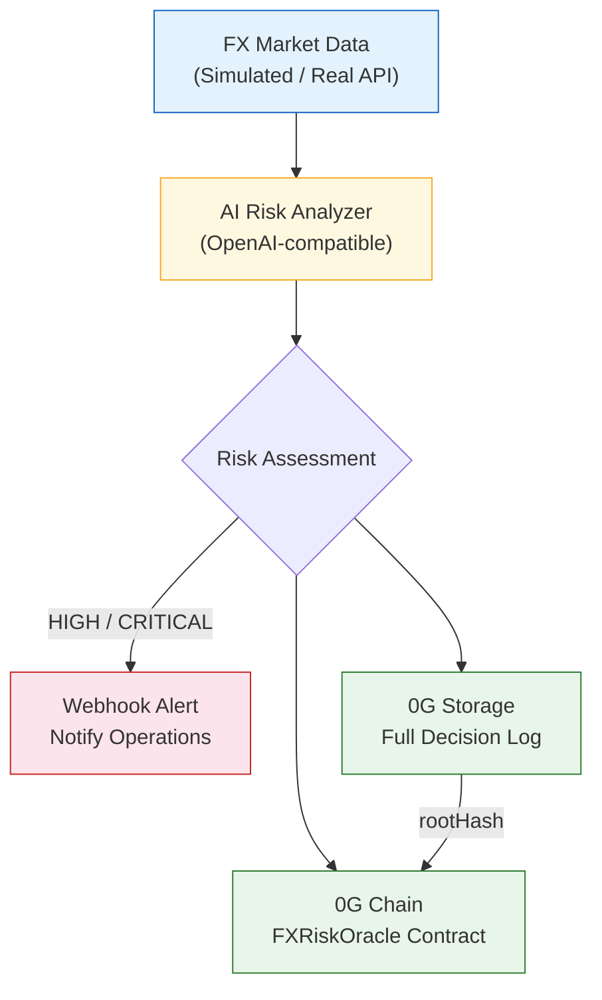

<p align="right">
  <b>English</b> | <a href="./README.zh-CN.md">中文</a>
</p>

# FX Risk Agent

> A verifiable AI-powered FX risk monitoring agent on 0G Network — every decision permanently stored, on-chain recorded, fully auditable.

<p align="center">
  <a href="https://youtu.be/j2eaoJN18a8">
    
  </a>
  <a href="http://124.223.198.204:9088">
    
  </a>
  <a href="https://chainscan-galileo.0g.ai/address/0x12030bc39dd18E2e8e4F10e685b7B7E639F0925A">
    
  </a>
</p>

## Live Demo

- **Demo Video**: [Watch on YouTube (2:37)](https://youtu.be/j2eaoJN18a8)
- **Dashboard**: [http://124.223.198.204:9088](http://124.223.198.204:9088)
- **Contract (Galileo Testnet)**: [`0x12030bc39dd18E2e8e4F10e685b7B7E639F0925A`](https://chainscan-galileo.0g.ai/address/0x12030bc39dd18E2e8e4F10e685b7B7E639F0925A)
- **Explorer**: [View on 0G Chain](https://chainscan-galileo.0g.ai/address/0x12030bc39dd18E2e8e4F10e685b7B7E639F0925A)

## Problem

The cross-border payment industry processes billions in daily FX transactions. Common risk patterns include:

- **Currency pair inversion** — Upstream rate sources occasionally return inverted pairs (e.g., USD/X vs X/USD swap), potentially producing 100x+ pricing errors
- **Rate source outage** — External feed disruptions cause FX quote generation to fail, impacting customer transactions
- **No audit trail** — After incidents, teams can't reconstruct what the system knew, when it knew it, and what decisions were made

Manual monitoring misses critical windows. Decision trails are scattered. Post-incident audits lack verifiable evidence.

## Solution

FX Risk Agent is an autonomous AI agent that **monitors, judges, records, and alerts** — with every decision permanently verifiable on the 0G blockchain.

```
FX Market Data → AI Analysis → Alert (HIGH/CRITICAL) → 0G Storage (full log) → 0G Chain (on-chain proof)
```

**Core value proposition:**
1. **AI cuts noise** — Not threshold alerts that fire 100x/day. AI understands market context, only escalates when it matters.
2. **Structured audit trail** — Every decision (including "no risk" judgments) is permanently stored with full reasoning on 0G Storage.
3. **On-chain proof** — Risk alerts recorded on-chain with Storage rootHash. Anyone can verify: chain record → download full AI decision log → check reasoning.

## Architecture



## Why 0G?

| 0G Component | What We Use It For | Why It's Essential |
|---|---|---|
| **0G Storage** | Permanent archive of full AI decision logs (JSON with reasoning) | Tamper-proof audit trail — can't silently edit what the AI said |
| **0G Chain** | FXRiskOracle contract records risk alerts with Storage rootHash | Verifiable proof that the alert existed at a specific time |
| **0G Compute** *(roadmap)* | Sealed Inference for confidential FX exposure analysis | Prevents front-running of trading strategies |
| **Agent ID** *(roadmap)* | Accountable autonomous agent identity | Proves which agent made which decision |

## 0G Integration Verification

```
1. Chain Explorer → See 4 on-chain alerts with rootHash
   https://chainscan-galileo.0g.ai/address/0x12030bc39dd18E2e8e4F10e685b7B7E639F0925A

2. Each alert contains:
   - currencyPair (e.g. "USD/CNY")
   - riskLevel (LOW/MEDIUM/HIGH/CRITICAL)
   - spotRate (6-decimal fixed point)
   - storageRootHash → points to full decision log in 0G Storage
   - timestamp (block time)
   - reporter (agent wallet)

3. Download full decision log from 0G Storage using rootHash
   → Contains complete AI reasoning, market data, and recommendation
```

## Tech Stack

| Layer | Technology | Notes |
|---|---|---|
| AI Model | Doubao Seed 2.0 Pro | OpenAI-compatible, swappable |
| Smart Contract | Solidity 0.8.24 | Compiled with Foundry |
| 0G SDK | @0gfoundation/0g-ts-sdk 1.2.1 | Storage upload + chain interaction |
| Chain | 0G Galileo Testnet (16602) | EVM-compatible |
| Frontend | Vanilla HTML + ethers.js | Reads directly from 0G Chain |
| Language | TypeScript | End-to-end |

## Quick Start

```bash
# Install dependencies
npm install

# Copy and configure environment
cp .env.example .env
# Edit .env: add PRIVATE_KEY, AI_API_KEY

# Compile smart contract (requires Foundry)
forge build

# Deploy to 0G Galileo Testnet (need testnet tokens from faucet.0g.ai)
source .env && forge script script/Deploy.s.sol \
  --rpc-url $OG_RPC_URL --broadcast --private-key $PRIVATE_KEY --legacy --with-gas-price 3000000000

# Run the AI agent
npm run agent

# Run with specific scenario (for demo)
npx ts-node src/index.ts --pair USD/CNY --scenario crisis

# Fetch full AI decision log from 0G Storage by rootHash
npx ts-node src/tools/fetchLog.ts 0x526564ff261184de3fd17c90500c66aef0cee9f14e6fc12328b0abc35297fcdb
```

## Currency Pairs Monitored

| Pair | Corridor | Upper Bound | Lower Bound |
|---|---|---|---|
| USD/CNY | Cross-border RMB | 7.35 | 7.15 |
| EUR/USD | European settlements | 1.12 | 1.04 |
| GBP/USD | UK corridor | 1.30 | 1.22 |
| USD/JPY | Japan corridor | 158.0 | 148.0 |

## Risk Levels

| Level | Trigger | Action |
|---|---|---|
| LOW | Rate within normal range | Logged for audit |
| MEDIUM | Approaching threshold (within 30%) | Logged + increased monitoring |
| HIGH | Threshold breached or volatility spike | **Webhook alert to operations** |
| CRITICAL | Multiple indicators triggered | **Immediate alert + escalation** |

## Roadmap

- [x] AI risk analysis with verifiable decision logs
- [x] 0G Storage integration (permanent audit trail)
- [x] On-chain alert recording (FXRiskOracle contract)
- [x] Webhook alerting for HIGH/CRITICAL events
- [x] Web dashboard (verifiable risk cockpit)
- [x] CLI tool: fetch full AI log from 0G Storage by rootHash
- [ ] Real FX data feed (Alpha Vantage / Twelve Data)
- [ ] 0G Compute: Sealed Inference for strategy privacy
- [ ] 0G Agent ID: accountable autonomous agent identity
- [ ] Mainnet deployment
- [ ] Multi-agent collaboration per currency corridor

## Known Limitations

- FX data is currently simulated (production would use real API feeds)
- StorageScan does not support direct file lookup by root hash via URL
- No automated test suite yet (planned for final submission)

## About

Built by [@0xSmallironman](https://x.com/0xSmallironman) for the [0G APAC Hackathon](https://www.hackquest.io/hackathons/0G-APAC-Hackathon) — Track 2: Agentic Trading Arena (Verifiable Finance).

*5 years of cross-border payment infrastructure experience (FIX 4.4, SWIFT MT103, ISO 20022). "From SWIFT to Smart Contracts."*

## License

MIT
