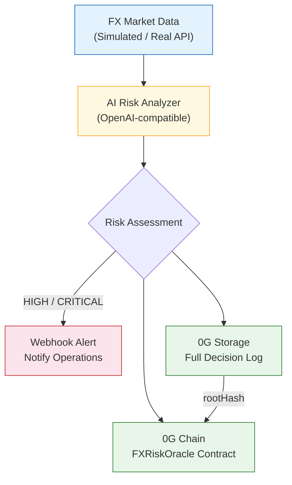

<p align="right">
  <b>English</b> | <a href="./README.zh-CN.md">中文</a>
</p>

# FX Risk Agent

> A verifiable AI-powered FX risk monitoring agent on 0G Network — every decision permanently stored, on-chain recorded, fully auditable.

<p align="center">
  <a href="https://youtu.be/j2eaoJN18a8">
    
  </a>
  <a href="http://124.223.198.204:9088">
    
  </a>
  <a href="https://chainscan-galileo.0g.ai/address/0x12030bc39dd18E2e8e4F10e685b7B7E639F0925A">
    
  </a>
</p>

## Live Demo

- **Demo Video**: [Watch on YouTube (2:37)](https://youtu.be/j2eaoJN18a8)
- **Dashboard**: [http://124.223.198.204:9088](http://124.223.198.204:9088)

**On-Chain Contracts (0G Galileo Testnet, Chain ID 16602):**

| Contract | Address | Role |
|---|---|---|
| **FXRiskOracleV2** | [`0x2ddfe5669e712d31d8013ebf3034ea72d668c6bf`](https://chainscan-galileo.0g.ai/address/0x2ddfe5669e712d31d8013ebf3034ea72d668c6bf) | Primary oracle with Agent ID linkage |
| **FXRiskAgentINFT** | [`0xcf9b3d3ea674853dfc9031fbb6ac2e3de9ca6cd2`](https://chainscan-galileo.0g.ai/address/0xcf9b3d3ea674853dfc9031fbb6ac2e3de9ca6cd2) | Agent identity (ERC-7857 inspired INFT) |
| **FXRiskOracle V1** | [`0x12030bc39dd18E2e8e4F10e685b7B7E639F0925A`](https://chainscan-galileo.0g.ai/address/0x12030bc39dd18E2e8e4F10e685b7B7E639F0925A) | Legacy (historical audit trail) |

## Problem

The cross-border payment industry processes billions in daily FX transactions. Common risk patterns include:

- **Currency pair inversion** — Upstream rate sources occasionally return inverted pairs (e.g., USD/X vs X/USD swap), potentially producing 100x+ pricing errors
- **Rate source outage** — External feed disruptions cause FX quote generation to fail, impacting customer transactions
- **No audit trail** — After incidents, teams can't reconstruct what the system knew, when it knew it, and what decisions were made

Manual monitoring misses critical windows. Decision trails are scattered. Post-incident audits lack verifiable evidence.

## Solution

FX Risk Agent is an autonomous AI agent that **monitors, judges, records, and alerts** — with every decision permanently verifiable on the 0G blockchain.

```
FX Market Data → AI Analysis → Alert (HIGH/CRITICAL) → 0G Storage (full log) → 0G Chain (on-chain proof)
```

**Core value proposition:**
1. **AI cuts noise** — Not threshold alerts that fire 100x/day. AI understands market context, only escalates when it matters.
2. **Structured audit trail** — Every decision (including "no risk" judgments) is permanently stored with full reasoning on 0G Storage.
3. **On-chain proof** — Risk alerts recorded on-chain with Storage rootHash. Anyone can verify: chain record → download full AI decision log → check reasoning.

## Architecture



## Why 0G?

| 0G Component | Status | What We Use It For |
|---|---|---|
| **0G Storage** | Integrated | Permanent archive of full AI decision logs (JSON with reasoning) — tamper-proof audit trail |
| **0G Chain** | Integrated | FXRiskOracleV2 contract records risk alerts with Storage rootHash + Agent ID linkage |
| **0G Compute** | Integrated | Dual-backend AI: Doubao (default, high-quality) and 0G Compute (Qwen 2.5 7B on TEE). Switchable via `AI_BACKEND` env var |
| **Agent ID (ERC-7857 INFT)** | Integrated | FXRiskAgentINFT tokenizes the agent's identity. Every inference updates the on-chain `inferenceCount`. Each alert links to Agent `tokenId=0` |

## 0G Integration Verification

```
1. Chain Explorer → See 4 on-chain alerts with rootHash
   https://chainscan-galileo.0g.ai/address/0x12030bc39dd18E2e8e4F10e685b7B7E639F0925A

2. Each alert contains:
   - currencyPair (e.g. "USD/CNY")
   - riskLevel (LOW/MEDIUM/HIGH/CRITICAL)
   - spotRate (6-decimal fixed point)
   - storageRootHash → points to full decision log in 0G Storage
   - timestamp (block time)
   - reporter (agent wallet)

3. Download full decision log from 0G Storage using rootHash
   → Contains complete AI reasoning, market data, and recommendation
```

## Tech Stack

| Layer | Technology | Notes |
|---|---|---|
| AI Model | Doubao Seed 2.0 Pro | OpenAI-compatible, swappable |
| Smart Contract | Solidity 0.8.24 | Compiled with Foundry |
| 0G SDK | @0gfoundation/0g-ts-sdk 1.2.1 | Storage upload + chain interaction |
| Chain | 0G Galileo Testnet (16602) | EVM-compatible |
| Frontend | Vanilla HTML + ethers.js | Reads directly from 0G Chain |
| Language | TypeScript | End-to-end |

## Quick Start

```bash
# Install dependencies
npm install

# Copy and configure environment
cp .env.example .env
# Edit .env: add PRIVATE_KEY, AI_API_KEY

# Compile smart contract (requires Foundry)
forge build

# Deploy to 0G Galileo Testnet (need testnet tokens from faucet.0g.ai)
source .env && forge script script/Deploy.s.sol \
  --rpc-url $OG_RPC_URL --broadcast --private-key $PRIVATE_KEY --legacy --with-gas-price 3000000000

# Run the AI agent
npm run agent

# Run with specific scenario (for demo)
npx ts-node src/index.ts --pair USD/CNY --scenario crisis

# Fetch full AI decision log from 0G Storage by rootHash
npx ts-node src/tools/fetchLog.ts 0x526564ff261184de3fd17c90500c66aef0cee9f14e6fc12328b0abc35297fcdb
```

## Currency Pairs Monitored

| Pair | Corridor | Upper Bound | Lower Bound |
|---|---|---|---|
| USD/CNY | Cross-border RMB | 7.35 | 7.15 |
| EUR/USD | European settlements | 1.12 | 1.04 |
| GBP/USD | UK corridor | 1.30 | 1.22 |
| USD/JPY | Japan corridor | 158.0 | 148.0 |

## Risk Levels

| Level | Trigger | Action |
|---|---|---|
| LOW | Rate within normal range | Logged for audit |
| MEDIUM | Approaching threshold (within 30%) | Logged + increased monitoring |
| HIGH | Threshold breached or volatility spike | **Webhook alert to operations** |
| CRITICAL | Multiple indicators triggered | **Immediate alert + escalation** |

## Roadmap

- [x] AI risk analysis with verifiable decision logs
- [x] 0G Storage integration (permanent audit trail)
- [x] On-chain alert recording (FXRiskOracle V1 + V2 contracts)
- [x] Webhook alerting for HIGH/CRITICAL events
- [x] Web dashboard (verifiable risk cockpit with V1/V2 merge + Agent badges)
- [x] CLI tool: fetch full AI log from 0G Storage by rootHash
- [x] **0G Compute integration** (dual-backend: Doubao + 0G Compute Qwen 2.5 7B with TEE)
- [x] **0G Agent ID** (ERC-7857 INFT, on-chain `inferenceCount`, accountable identity)
- [ ] Real FX data feed (Alpha Vantage / Twelve Data)
- [ ] 0G Compute Sealed Inference for strategy privacy (mainnet TEE)
- [ ] Mainnet deployment
- [ ] Multi-agent collaboration per currency corridor

## Agent ID (ERC-7857 INFT)

The agent has a **first-class on-chain identity**. This isn't just metadata — it's a tokenized AI asset:

```
FXRiskAgentINFT contract: 0xcf9b3d3ea674853dfc9031fbb6ac2e3de9ca6cd2
Agent Token ID: #0
Name: "FX Risk Agent"
Version: v0.2.0
Model Type: fx-risk-inference
Storage Root: 0x6a271e80f82f8bea6997756e9719ccf25587aaa3313c85c03bf89e4550729d96
             (points to full metadata JSON on 0G Storage)
```

**Every session updates on-chain state**:
- Session summary (processed pairs, decision log hashes) uploaded to 0G Storage
- `FXRiskAgentINFT.updateAgentState(tokenId, sessionRootHash)` called
- `inferenceCount` increments on-chain — provable history of agent activity

**Every V2 alert is linked to the Agent ID**:
```solidity
submitAlert(pair, level, rate, threshold, rootHash, agentTokenId, aiBackend)
```

**Why this matters**:
- **Accountability**: Any decision is traceable to a specific agent version with a signed system prompt
- **Tradeability**: Future AI-as-an-asset models — the INFT can be transferred/licensed
- **Auditability**: Regulators can query `getAgent(tokenId)` for full metadata

## Dual AI Backend

Switch between two AI backends via `AI_BACKEND` env variable:

```bash
# Doubao (default) — high-quality Chinese AI, used for demo
AI_BACKEND=doubao npm run agent

# 0G Compute — decentralized inference on 0G Network
AI_BACKEND=0g-compute npm run agent
```

| Backend | Model | Verification | Use Case |
|---|---|---|---|
| `doubao` | Doubao Seed 2.0 Pro | OpenAI-compatible API | Production demo with best reasoning quality |
| `0g-compute` | Qwen 2.5 7B (testnet) / GLM-5 (mainnet) | **TEE Sealed Inference** (cryptographic proof) | Privacy-preserving strategy execution |

Every AI response from `0g-compute` backend is:
1. Executed inside a hardware TEE (Intel TDX + NVIDIA GPU)
2. Cryptographically signed by the provider's enclave key
3. Verified via `broker.inference.processResponse()` — returns `verified: true/false`

The `DecisionLog` stored on 0G Storage includes the `inferenceVerification` field with the chat ID and verification result.

## Known Limitations

- FX data is currently simulated (production would use real API feeds like Alpha Vantage)
- 0G Compute on testnet only offers Qwen 2.5 7B (weaker than Doubao Seed 2.0 Pro); mainnet has GLM-5, DeepSeek V3.1
- StorageScan does not support direct file lookup by root hash via URL
- No automated test suite yet (planned for final submission)
- Not deployed to mainnet (requires real 0G tokens, planned before May 16)

## About

Built by [@0xSmallironman](https://x.com/0xSmallironman) for the [0G APAC Hackathon](https://www.hackquest.io/hackathons/0G-APAC-Hackathon) — Track 2: Agentic Trading Arena (Verifiable Finance).

*5 years of cross-border payment infrastructure experience (FIX 4.4, SWIFT MT103, ISO 20022). "From SWIFT to Smart Contracts."*

## License

MIT
