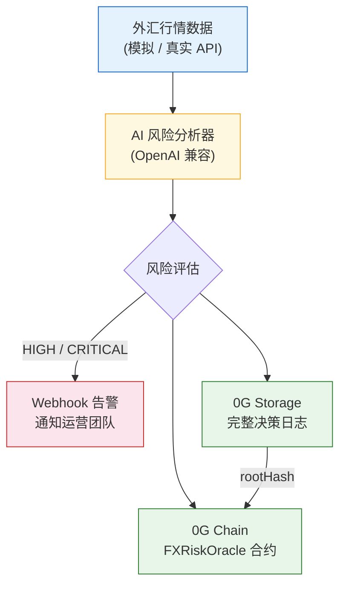

<p align="right">
  <a href="./README.md">English</a> | <b>中文</b>
</p>

# FX Risk Agent

> 基于 0G Network 的可验证 AI 外汇风险监控 Agent —— 每个决策永久存储、上链记录、完全可审计。

<p align="center">
  <a href="https://youtu.be/j2eaoJN18a8">
    
  </a>
  <a href="http://fx.0xsmall.com">
    
  </a>
  <a href="https://chainscan-galileo.0g.ai/address/0x12030bc39dd18E2e8e4F10e685b7B7E639F0925A">
    
  </a>
</p>

## 在线 Demo

- **Demo 视频**: [在 YouTube 观看 (2:37)](https://youtu.be/j2eaoJN18a8)
- **Dashboard**: [http://fx.0xsmall.com](http://fx.0xsmall.com)

**链上合约（0G Galileo 测试网，Chain ID 16602）：**

| 合约 | 地址 | 用途 |
|---|---|---|
| **FXRiskOracleV2** | [`0x2ddfe5669e712d31d8013ebf3034ea72d668c6bf`](https://chainscan-galileo.0g.ai/address/0x2ddfe5669e712d31d8013ebf3034ea72d668c6bf) | 主力合约（带 Agent ID + AI 后端标识） |
| **FXRiskAgentINFT** | [`0xcf9b3d3ea674853dfc9031fbb6ac2e3de9ca6cd2`](https://chainscan-galileo.0g.ai/address/0xcf9b3d3ea674853dfc9031fbb6ac2e3de9ca6cd2) | Agent 身份（ERC-7857 启发的 INFT） |
| **FXRiskOracle V1** | [`0x12030bc39dd18E2e8e4F10e685b7B7E639F0925A`](https://chainscan-galileo.0g.ai/address/0x12030bc39dd18E2e8e4F10e685b7B7E639F0925A) | 历史审计数据（保留不变） |

## 问题背景

跨境支付行业每天处理数十亿美元外汇交易。常见的风险类型：

- **币种对方向反转** —— 上游汇率源返回的币种对方向弄反（如 USD/X 与 X/USD 互换），可能造成成百倍的汇率计算偏差
- **参考汇率数据缺失** —— 外部数据源中断或延迟，导致换汇报价无法正常生成，影响客户交易
- **无审计链路** —— 事故后，团队无法还原"系统当时知道什么、什么时候知道、做了什么决策"

人工盯盘会漏关键窗口。决策记录散落各处。事后审计缺乏可验证证据。

## 解决方案

FX Risk Agent 是一个自主 AI Agent，**监控、判断、记录、告警** —— 每一个决策都永久可验证，存储在 0G 区块链上。

```
外汇行情 → AI 分析 → 告警（HIGH/CRITICAL）→ 0G Storage（完整日志）→ 0G Chain（链上证据）
```

**核心价值主张：**
1. **AI 降噪** —— 不是一天触发 100 次的阈值警报。AI 理解市场上下文，只在真正需要时才升级告警
2. **结构化审计链路** —— 每个决策（包括"无风险"的判断）都带完整推理过程永久存储在 0G Storage
3. **链上证据** —— 风险预警以 Storage rootHash 的形式记录上链。任何人都可验证：链上记录 → 下载完整 AI 决策日志 → 核对推理过程

## 架构



## 为什么选 0G？

| 0G 组件 | 状态 | 我们如何使用 |
|---|---|---|
| **0G Storage** | 已集成 | 永久存档完整 AI 决策日志（含推理过程的 JSON）—— 不可篡改的审计链路 |
| **0G Chain** | 已集成 | FXRiskOracleV2 合约记录风险预警，关联 Storage rootHash + Agent ID |
| **0G Compute** | 已集成 | 双后端 AI：豆包（默认，高质量）+ 0G Compute（Qwen 2.5 7B 跑在 TEE 里），通过 `AI_BACKEND` 环境变量切换 |
| **Agent ID (ERC-7857 INFT)** | 已集成 | FXRiskAgentINFT 将 Agent 身份代币化。每次推理链上自增 `inferenceCount`，每条告警都关联 Agent `tokenId=0` |

## 0G 集成验证路径

```
1. 通过区块浏览器查看 4 条带 rootHash 的链上告警
   https://chainscan-galileo.0g.ai/address/0x12030bc39dd18E2e8e4F10e685b7B7E639F0925A

2. 每条告警包含：
   - currencyPair（货币对，如 "USD/CNY"）
   - riskLevel（风险等级：LOW/MEDIUM/HIGH/CRITICAL）
   - spotRate（即期汇率，6 位小数定点数）
   - storageRootHash → 指向 0G Storage 中的完整决策日志
   - timestamp（区块时间戳）
   - reporter（Agent 钱包地址）

3. 使用 rootHash 从 0G Storage 下载完整决策日志
   → 包含完整的 AI 推理过程、市场数据、建议
```

## 技术栈

| 层级 | 技术 | 说明 |
|---|---|---|
| AI 模型 | 豆包 Seed 2.0 Pro | 兼容 OpenAI 接口，可替换 |
| 智能合约 | Solidity 0.8.24 | 使用 Foundry 编译 |
| 0G SDK | @0gfoundation/0g-ts-sdk 1.2.1 | Storage 上传 + 链上交互 |
| 区块链 | 0G Galileo 测试网 (16602) | EVM 兼容 |
| 前端 | 原生 HTML + ethers.js | 直接从 0G Chain 读取 |
| 语言 | TypeScript | 端到端统一 |

## 快速开始

```bash
# 安装依赖
npm install

# 拷贝并配置环境变量
cp .env.example .env
# 编辑 .env：填入 PRIVATE_KEY、AI_API_KEY

# 编译智能合约（需要 Foundry）
forge build

# 部署到 0G Galileo 测试网（需先从 faucet.0g.ai 领取测试币）
source .env && forge script script/Deploy.s.sol \
  --rpc-url $OG_RPC_URL --broadcast --private-key $PRIVATE_KEY --legacy --with-gas-price 3000000000

# 运行 AI Agent
npm run agent

# 指定场景运行（演示用）
npx ts-node src/index.ts --pair USD/CNY --scenario crisis

# 通过 rootHash 从 0G Storage 下载完整决策日志
npx ts-node src/tools/fetchLog.ts 0x526564ff261184de3fd17c90500c66aef0cee9f14e6fc12328b0abc35297fcdb
```

## 监控的货币对

| 货币对 | 应用场景 | 上限阈值 | 下限阈值 |
|---|---|---|---|
| USD/CNY | 跨境人民币结算 | 7.35 | 7.15 |
| EUR/USD | 欧洲贸易结算 | 1.12 | 1.04 |
| GBP/USD | 英国跨境支付 | 1.30 | 1.22 |
| USD/JPY | 日本跨境支付 | 158.0 | 148.0 |

## 风险等级

| 等级 | 触发条件 | 对应动作 |
|---|---|---|
| LOW | 汇率在正常区间内 | 记录审计 |
| MEDIUM | 接近阈值（30% 以内） | 记录 + 加强监控 |
| HIGH | 突破阈值或波动率飙升 | **Webhook 通知运营团队** |
| CRITICAL | 多个指标同时触发 | **立即告警 + 升级处理** |

## 路线图

- [x] AI 风险分析与可验证决策日志
- [x] 0G Storage 集成（永久审计链路）
- [x] 链上告警记录（FXRiskOracle V1 + V2 合约）
- [x] HIGH/CRITICAL 事件 Webhook 告警
- [x] Web Dashboard（V1/V2 合并 + Agent 徽章可视化）
- [x] CLI 工具：通过 rootHash 从 Storage 下载完整 AI 日志
- [x] **0G Compute 集成**（双后端：豆包 + 0G Compute Qwen 2.5 7B with TEE）
- [x] **0G Agent ID**（ERC-7857 INFT，链上 `inferenceCount`，可追溯身份）
- [ ] 接入真实外汇行情源（Alpha Vantage / Twelve Data）
- [ ] 0G Compute Sealed Inference 保护交易策略（主网 TEE）
- [ ] 部署至主网
- [ ] 多 Agent 协作（每个货币对独立 Agent）

## Agent ID (ERC-7857 INFT)

Agent 拥有**一等公民的链上身份**。这不只是元数据 —— 是被代币化的 AI 资产：

```
FXRiskAgentINFT 合约: 0xcf9b3d3ea674853dfc9031fbb6ac2e3de9ca6cd2
Agent Token ID: #0
名称: "FX Risk Agent"
版本: v0.2.0
模型类型: fx-risk-inference
Storage Root: 0x6a271e80f82f8bea... (指向 0G Storage 上的完整元数据 JSON)
```

**每次会话更新链上状态**：
- 会话摘要（处理的货币对、决策日志哈希列表）上传到 0G Storage
- 调用 `FXRiskAgentINFT.updateAgentState(tokenId, sessionRootHash)`
- 链上 `inferenceCount` 自增 —— Agent 活动历史可验证

**每条 V2 告警都关联 Agent ID**：
```solidity
submitAlert(pair, level, rate, threshold, rootHash, agentTokenId, aiBackend)
```

**价值**：
- **可问责**：任何决策都可追溯到具体 Agent 版本 + 签名过的系统 prompt
- **可交易**：未来 AI-as-an-asset 模型 —— INFT 可转让/授权
- **可审计**：监管可通过 `getAgent(tokenId)` 查询完整元数据

## 双 AI 后端

通过 `AI_BACKEND` 环境变量切换两个后端：

```bash
# 豆包（默认）—— 高质量中文 AI，用于 Demo
AI_BACKEND=doubao npm run agent

# 0G Compute —— 去中心化 AI 推理
AI_BACKEND=0g-compute npm run agent
```

| 后端 | 模型 | 验证方式 | 场景 |
|---|---|---|---|
| `doubao` | 豆包 Seed 2.0 Pro | OpenAI 兼容 API | 生产 Demo，推理质量最好 |
| `0g-compute` | Qwen 2.5 7B（testnet）/ GLM-5（mainnet） | **TEE Sealed Inference**（硬件加密证明） | 隐私保护的策略执行 |

`0g-compute` 后端的每个 AI 响应都会：
1. 在硬件 TEE 中执行（Intel TDX + NVIDIA GPU）
2. 由 provider 的 enclave 密钥做硬件签名
3. 通过 `broker.inference.processResponse()` 验证 —— 返回 `verified: true/false`

存储到 0G Storage 的 `DecisionLog` 包含 `inferenceVerification` 字段（含 chatId + 验证结果）。

## 已知限制

- 当前使用模拟外汇数据（生产环境会接入真实 API）
- 0G Compute testnet 仅有 Qwen 2.5 7B（质量弱于豆包 Seed 2.0 Pro），mainnet 有 GLM-5、DeepSeek V3.1
- StorageScan 暂不支持通过 rootHash 直接定位文件
- 尚无自动化测试套件（最终提交时会补充）
- 未部署到 mainnet（需真实 0G 代币，计划 5/16 前完成）

## 关于

由 [@0xSmallironman](https://x.com/0xSmallironman) 为 [0G APAC Hackathon](https://www.hackquest.io/hackathons/0G-APAC-Hackathon) 打造 —— Track 2：Agentic Trading Arena (Verifiable Finance)。

*5 年跨境支付基础设施经验（FIX 4.4、SWIFT MT103、ISO 20022）。"From SWIFT to Smart Contracts."*

## 许可证

MIT
