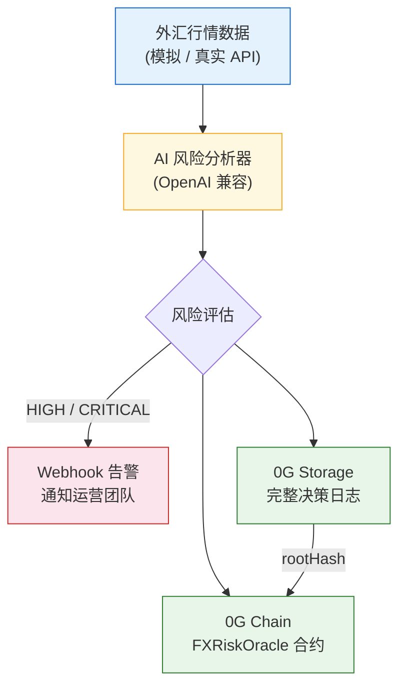

<p align="right">
  <a href="./README.md">English</a> | <b>中文</b>
</p>

# FX Risk Agent

> 基于 0G Network 的可验证 AI 外汇风险监控 Agent —— 每个决策永久存储、上链记录、完全可审计。

## 在线 Demo

- **Dashboard**: [http://124.223.198.204:9088](http://124.223.198.204:9088)
- **合约地址（Galileo 测试网）**: [`0x12030bc39dd18E2e8e4F10e685b7B7E639F0925A`](https://chainscan-galileo.0g.ai/address/0x12030bc39dd18E2e8e4F10e685b7B7E639F0925A)
- **区块浏览器**: [在 0G Chain 上查看](https://chainscan-galileo.0g.ai/address/0x12030bc39dd18E2e8e4F10e685b7B7E639F0925A)

## 问题背景

跨境支付公司每天处理数十亿美元外汇交易。真实事故不断发生：

- **币种对方向反转** —— 某支付渠道返回 USD/ZAR=16，而实际应为 ZAR/USD=0.06（260 倍误差），造成巨额损失
- **参考汇率数据缺失** —— 中行参考汇率数据中断，影响 数千名客户、数千笔交易
- **无审计链路** —— 事故后，团队无法还原"系统当时知道什么、什么时候知道、做了什么决策"

人工盯盘会漏关键窗口。决策记录散落各处。事后审计缺乏可验证证据。

## 解决方案

FX Risk Agent 是一个自主 AI Agent，**监控、判断、记录、告警** —— 每一个决策都永久可验证，存储在 0G 区块链上。

```
外汇行情 → AI 分析 → 告警（HIGH/CRITICAL）→ 0G Storage（完整日志）→ 0G Chain（链上证据）
```

**核心价值主张：**
1. **AI 降噪** —— 不是一天触发 100 次的阈值警报。AI 理解市场上下文，只在真正需要时才升级告警
2. **结构化审计链路** —— 每个决策（包括"无风险"的判断）都带完整推理过程永久存储在 0G Storage
3. **链上证据** —— 风险预警以 Storage rootHash 的形式记录上链。任何人都可验证：链上记录 → 下载完整 AI 决策日志 → 核对推理过程

## 架构



## 为什么选 0G？

| 0G 组件 | 我们如何使用 | 为什么必须用 0G |
|---|---|---|
| **0G Storage** | 永久存档完整 AI 决策日志（含推理过程的 JSON） | 不可篡改的审计链路 —— 无法悄悄修改 AI 当时说过什么 |
| **0G Chain** | FXRiskOracle 合约记录风险预警与 Storage rootHash | 可验证的证据，证明告警在特定时刻确实存在 |
| **0G Compute** *(路线图)* | Sealed Inference 用于机密外汇敞口分析 | 防止交易策略被抢跑 |
| **Agent ID** *(路线图)* | 可追溯的自主 Agent 身份 | 证明是哪个 Agent 做出了哪个决策 |

## 0G 集成验证路径

```
1. 通过区块浏览器查看 4 条带 rootHash 的链上告警
   https://chainscan-galileo.0g.ai/address/0x12030bc39dd18E2e8e4F10e685b7B7E639F0925A

2. 每条告警包含：
   - currencyPair（货币对，如 "USD/CNY"）
   - riskLevel（风险等级：LOW/MEDIUM/HIGH/CRITICAL）
   - spotRate（即期汇率，6 位小数定点数）
   - storageRootHash → 指向 0G Storage 中的完整决策日志
   - timestamp（区块时间戳）
   - reporter（Agent 钱包地址）

3. 使用 rootHash 从 0G Storage 下载完整决策日志
   → 包含完整的 AI 推理过程、市场数据、建议
```

## 技术栈

| 层级 | 技术 | 说明 |
|---|---|---|
| AI 模型 | 豆包 Seed 2.0 Pro | 兼容 OpenAI 接口，可替换 |
| 智能合约 | Solidity 0.8.24 | 使用 Foundry 编译 |
| 0G SDK | @0gfoundation/0g-ts-sdk 1.2.1 | Storage 上传 + 链上交互 |
| 区块链 | 0G Galileo 测试网 (16602) | EVM 兼容 |
| 前端 | 原生 HTML + ethers.js | 直接从 0G Chain 读取 |
| 语言 | TypeScript | 端到端统一 |

## 快速开始

```bash
# 安装依赖
npm install

# 拷贝并配置环境变量
cp .env.example .env
# 编辑 .env：填入 PRIVATE_KEY、AI_API_KEY

# 编译智能合约（需要 Foundry）
forge build

# 部署到 0G Galileo 测试网（需先从 faucet.0g.ai 领取测试币）
source .env && forge script script/Deploy.s.sol \
  --rpc-url $OG_RPC_URL --broadcast --private-key $PRIVATE_KEY --legacy --with-gas-price 3000000000

# 运行 AI Agent
npm run agent

# 指定场景运行（演示用）
npx ts-node src/index.ts --pair USD/CNY --scenario crisis

# 通过 rootHash 从 0G Storage 下载完整决策日志
npx ts-node src/tools/fetchLog.ts 0x526564ff261184de3fd17c90500c66aef0cee9f14e6fc12328b0abc35297fcdb
```

## 监控的货币对

| 货币对 | 走廊 | 上限阈值 | 下限阈值 |
|---|---|---|---|
| USD/CNY | 跨境人民币 | 7.35 | 7.15 |
| EUR/USD | 欧洲结算 | 1.12 | 1.04 |
| GBP/USD | 英国走廊 | 1.30 | 1.22 |
| USD/JPY | 日本走廊 | 158.0 | 148.0 |

## 风险等级

| 等级 | 触发条件 | 对应动作 |
|---|---|---|
| LOW | 汇率在正常区间内 | 记录审计 |
| MEDIUM | 接近阈值（30% 以内） | 记录 + 加强监控 |
| HIGH | 突破阈值或波动率飙升 | **Webhook 通知运营团队** |
| CRITICAL | 多个指标同时触发 | **立即告警 + 升级处理** |

## 路线图

- [x] AI 风险分析与可验证决策日志
- [x] 0G Storage 集成（永久审计链路）
- [x] 链上告警记录（FXRiskOracle 合约）
- [x] HIGH/CRITICAL 事件 Webhook 告警
- [x] Web Dashboard（可验证风控驾驶舱）
- [x] CLI 工具：通过 rootHash 从 Storage 下载完整 AI 日志
- [ ] 接入真实外汇行情源（Alpha Vantage / Twelve Data）
- [ ] 0G Compute：Sealed Inference 保护策略隐私
- [ ] 0G Agent ID：可追溯的自主 Agent 身份
- [ ] 部署至主网
- [ ] 多 Agent 协作（每个货币走廊独立 Agent）

## 已知限制

- 当前使用模拟外汇数据（生产环境会接入真实 API）
- StorageScan 暂不支持通过 rootHash 直接定位文件
- 尚无自动化测试套件（最终提交时会补充）

## 关于

由 [@0xSmallironman](https://x.com/0xSmallironman) 为 [0G APAC Hackathon](https://www.hackquest.io/hackathons/0G-APAC-Hackathon) 打造 —— Track 2：Agentic Trading Arena (Verifiable Finance)。

*5 年跨境支付基础设施经验（FIX 4.4、SWIFT MT103、ISO 20022）。"From SWIFT to Smart Contracts."*

## 许可证

MIT
