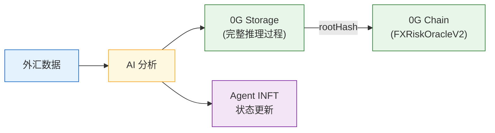
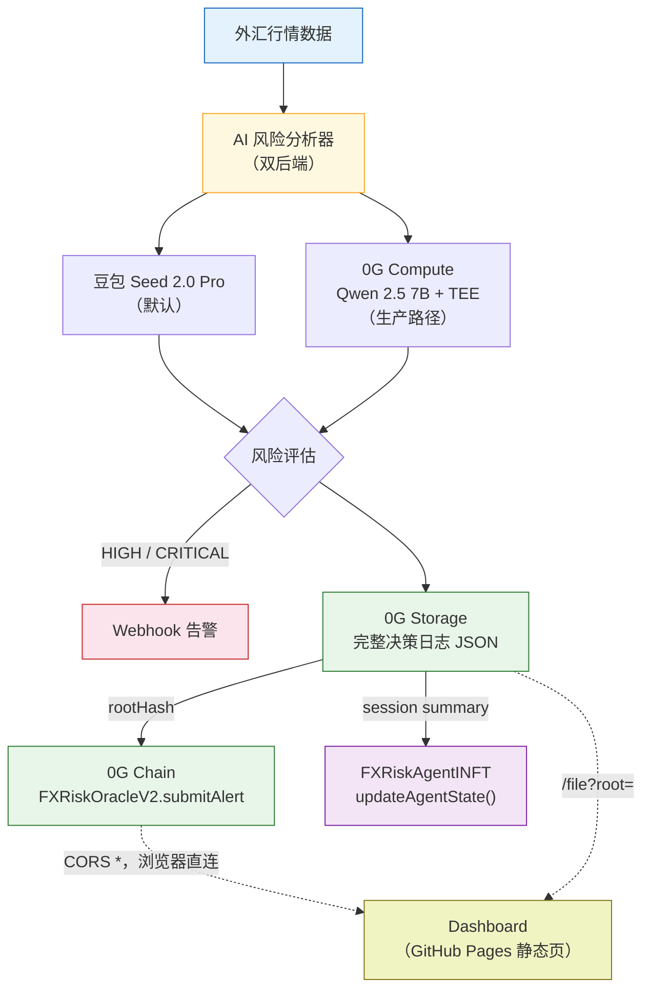

<p align="right">
  <a href="./README.md">English</a> | <b>中文</b>
</p>

# FX Risk Agent

> 基于 0G Network 的可验证 AI 外汇风控 Agent —— 每个决策永久存储、链上记录，Dashboard **直接在浏览器里从去中心化存储拉取数据**。

<p align="center">
  <a href="https://youtu.be/j2eaoJN18a8">
    
  </a>
  <a href="https://smallironman666.github.io/fx-risk-agent/">
    
  </a>
  <a href="https://chainscan-galileo.0g.ai/address/0x2abde2687923ffb9a5be4c6df3aac68a4f0a93ca">
    
  </a>
</p>

## 在线 Demo

- **Dashboard**：https://smallironman666.github.io/fx-risk-agent/ *（静态站，数据直接从 0G Storage 拉取）*
- **Demo 视频**：[在 YouTube 观看 (2:37)](https://youtu.be/j2eaoJN18a8)

**链上合约（0G Galileo 测试网，Chain ID 16602）：**

| 合约 | 地址 | 用途 |
|---|---|---|
| **FXRiskOracleV2** | [`0x2abde2687923ffb9a5be4c6df3aac68a4f0a93ca`](https://chainscan-galileo.0g.ai/address/0x2abde2687923ffb9a5be4c6df3aac68a4f0a93ca) | 主力合约（带 Agent ID + AI 后端标识 + 访问控制） |
| **FXRiskAgentINFT** | [`0xAA540f42f0d20588f183E3B92B3b617991fa22D1`](https://chainscan-galileo.0g.ai/address/0xAA540f42f0d20588f183E3B92B3b617991fa22D1) | Agent 身份（ERC-7857 启发的 INFT）—— Ownable + ReentrancyGuard |
| **FXRiskOracle V1** | [`0x12030bc39dd18E2e8e4F10e685b7B7E639F0925A`](https://chainscan-galileo.0g.ai/address/0x12030bc39dd18E2e8e4F10e685b7B7E639F0925A) | 历史审计数据（保留不变） |

## 问题背景

跨境支付行业每天处理数十亿美元外汇交易。常见风险类型：

- **币种对方向反转** —— 上游汇率源返回的币种对方向弄反（USD/X 与 X/USD 互换），可能造成百倍级汇率偏差
- **参考汇率数据缺失** —— 外部数据源中断或延迟，导致换汇报价无法生成，影响客户交易
- **无审计链路** —— 事故后，团队无法还原"AI 当时知道什么、什么时候知道、做了什么决策"

人工盯盘会漏关键窗口。决策记录散落在邮件、表格、Slack 里。事后审计缺乏可验证证据。

**更深层的鸿沟**："AI 做决策" 和 "AI 决策可审计" 之间隔着鸿沟。今天大多数 AI 系统产出没有密码学轨迹。

## 解决方案

FX Risk Agent 填平这个鸿沟。它是一个自主 AI Agent，**监控、判断、记录、告警** —— 每一个决策都永久可验证，全部在 0G Network 上。



**核心价值主张：**
1. **AI 降噪** —— 不是一天触发 100 次的阈值警报。AI 理解市场上下文，只在真正需要时才升级告警
2. **结构化审计链路** —— 每个决策（包括"无风险"的判断）都带完整推理过程永久存储在 0G Storage
3. **链上证据** —— 风险告警以 Storage rootHash 的形式上链。任何人可验证：链上记录 → 从 0G Storage 拉完整 AI 决策日志 → 核对推理过程

## 架构



## 为什么选 0G？

| 0G 组件 | 状态 | 我们如何使用 | 链上证据 |
|---|---|---|---|
| **0G Storage** | Live | 永久存档完整 AI 决策日志（含推理过程的 JSON）—— 不可篡改的审计链路 | 每条 alert 的 `storageRootHash` 字段，可通过 indexer API 解析 |
| **0G Chain** | Live | `FXRiskOracleV2` 记录告警，字段带 `agentTokenId` + `aiBackend`；V1 保留作历史审计 | [FXRiskOracleV2 合约](https://chainscan-galileo.0g.ai/address/0x2abde2687923ffb9a5be4c6df3aac68a4f0a93ca) |
| **0G Compute** | Live | 双后端推理（via `@0glabs/0g-serving-broker`）。0G Compute (Qwen 2.5 7B + TEE) 为主，Doubao 作 graceful fallback | `aiBackend="0g-compute"` 的告警 —— 全程链上结算（ledger + inference 模块），TEE 认证 |
| **Agent ID (ERC-7857 INFT)** | Live | `FXRiskAgentINFT` 将 Agent 身份代币化。每次会话调 `updateAgentState()` 使链上 `inferenceCount` 自增 | [INFT 合约 Token #0](https://chainscan-galileo.0g.ai/address/0xAA540f42f0d20588f183E3B92B3b617991fa22D1) |

**主动选择不集成**（见 [ADR-004](./docs/adr/004-skip-tee-privacy.md)）：Privacy / Secure Execution。我们的场景是审计/透明，不是保密。

## 0G 集成验证路径

任何人都可以独立验证 Dashboard 数据确实存在于 0G Storage：

```bash
# 1. 从 Chain Explorer 选一条链上告警
https://chainscan-galileo.0g.ai/address/0x2abde2687923ffb9a5be4c6df3aac68a4f0a93ca

# 2. 提取 storageRootHash 字段，例如
ROOT=0xfec46db02f1313e3b0e6c9833985ae83387f9eeb0f916ca88a8276d63da75842

# 3. 通过 indexer 验证文件已 finalized
curl "https://indexer-storage-testnet-turbo.0g.ai/file/info/$ROOT"
# → { "code": 0, "data": { "finalized": true, "size": 5399, ... } }

# 4. 下载完整 AI 决策日志（与 Dashboard 拉到的字节完全一致）
curl "https://indexer-storage-testnet-turbo.0g.ai/file?root=$ROOT"
# → 完整 JSON：AI 推理、置信度、推荐方案、TEE 验证状态……
```

Dashboard 在浏览器里做的就是同样的事 —— 0G indexer 的 CORS 全开（`Access-Control-Allow-Origin: *`），不需要后端。

## 安全架构

两个关键设计把信任边界在两端都闭合：

**访问控制 —— `onlyOwner` mint + `ownerOf` 提交：**
- 铸造新 Agent INFT 要求合约 `onlyOwner`
- 以 Agent #N 身份提交告警要求 `INFT.ownerOf(N) == msg.sender`
- 结果：没有 permissionless 路径能伪造"官方" AI 告警

**状态变更路径加重入保护：**
- `mintAgent` 和 `updateAgentState` 都继承 OpenZeppelin 的 `ReentrancyGuard`
- `mintAgent` 先写元数据**再**外调 `_safeMint` —— 恶意 `ERC721Receiver` 无法观察到写到一半的状态

两份合约均基于 OpenZeppelin 5.6.1（`Ownable`、`ReentrancyGuard`、`ERC721`），不自造访问控制轮子。

## Dashboard 架构（真·去中心化的静态站）

Dashboard 是**部署在 GitHub Pages 上的单个静态 HTML 文件**，**没有后端**。当你点击 "View AI Decision"：

1. 浏览器直接 `fetch https://indexer-storage-testnet-turbo.0g.ai/file?root={rootHash}`
2. 0G indexer 返回的字节与链上承诺的完全一致
3. `frontend/data/` 下的本地镜像仅作 graceful fallback

这是当 "Web3 前端" 不只是美学时的真实样子：**无 proxy、无中间人、无可信 API**。任何人可以用同一个 URL 跑 `curl` 拿到同一份字节。

## 技术栈

| 层级 | 技术 | 说明 |
|---|---|---|
| AI 推理 | **双后端**：豆包 Seed 2.0 Pro + 0G Compute (Qwen 2.5 7B, TEE) | 自动 fallback，`fallbackReason` 上链记录 |
| 智能合约 | Solidity 0.8.24 + OpenZeppelin 5.6.1 | Foundry 编译 + 测试 |
| 0G SDKs | `@0gfoundation/0g-ts-sdk`、`@0glabs/0g-serving-broker` | Storage 上传 + 可验证推理 |
| 区块链 | 0G Galileo 测试网（Chain ID 16602） | EVM 兼容 |
| 前端 | 原生 HTML + ethers.js | **直接从 0G Storage 拉取决策日志**（无后端） |
| 语言 | TypeScript | 端到端统一 |

## 快速开始

```bash
# 安装依赖
npm install

# 拷贝并配置环境变量
cp .env.example .env
# 编辑 .env：填入 PRIVATE_KEY、AI_API_KEY（豆包）

# 编译智能合约（需要 Foundry）
forge build

# 先部署 INFT，再部署 Oracle V2（Oracle 依赖 INFT 地址）
source .env && forge script script/DeployAgentINFT.s.sol \
  --rpc-url $OG_RPC_URL --broadcast --private-key $PRIVATE_KEY \
  --legacy --with-gas-price 3000000000

# 铸造 Token #0（一次性）
npx ts-node src/tools/mintAgent.ts

# 部署 Oracle V2
source .env && forge script script/DeployOracleV2.s.sol \
  --rpc-url $OG_RPC_URL --broadcast --private-key $PRIVATE_KEY \
  --legacy --with-gas-price 3000000000

# 跑 Agent
npm run agent                                              # 默认后端
AI_BACKEND=0g-compute npm run agent                        # 0G Compute 可验证推理
npx ts-node src/index.ts --pair USD/CNY --scenario crisis  # 指定场景

# Bootstrap 0G Compute（一次性，约消耗 4 OG）
npm run bootstrap-compute

# 通过 rootHash 从 0G Storage 下载完整决策日志
npx ts-node src/tools/fetchLog.ts 0xfec46db02f1313e3b0e6c9833985ae83387f9eeb0f916ca88a8276d63da75842
```

## 监控的货币对

| 货币对 | 场景 | 上限阈值 | 下限阈值 |
|---|---|---|---|
| USD/CNY | 跨境人民币结算 | 7.35 | 7.15 |
| EUR/USD | 欧洲贸易结算 | 1.12 | 1.04 |
| GBP/USD | 英国跨境支付 | 1.30 | 1.22 |
| USD/JPY | 日本跨境支付 | 158.0 | 148.0 |

## 风险等级

| 等级 | 触发条件 | 动作 |
|---|---|---|
| LOW | 汇率在正常区间 | 记录审计 |
| MEDIUM | 接近阈值（30% 以内） | 记录 + 加强监控 |
| HIGH | 突破阈值或波动率飙升 | **Webhook 通知运营团队** |
| CRITICAL | 多个指标同时触发 | **立即告警 + 升级处理** |

## 路线图

- [x] AI 风险分析 + 可验证决策日志
- [x] 0G Storage 集成（永久审计链路）
- [x] 链上告警记录（FXRiskOracle V1 + V2）
- [x] **0G Compute 集成**（双后端 + TEE 验证 + 自动 fallback）
- [x] **Agent ID (ERC-7857 INFT)** 带链上 `inferenceCount`
- [x] 合约层安全（Ownable + ReentrancyGuard + 访问控制告警）
- [x] Dashboard 直接从 0G Storage 拉取决策日志
- [x] HIGH/CRITICAL 事件 Webhook 告警
- [x] CLI 工具：通过 rootHash 下载完整 AI 日志
- [ ] INFT `tokenURI` —— 让钱包/浏览器渲染 Agent 元数据
- [ ] Historical Replay 模式（归档决策时间线）
- [ ] 接入真实外汇行情（Alpha Vantage / Twelve Data）
- [ ] 部署到主网（0G Aristotle, Chain ID 16661）
- [ ] 多 Agent 协作（每个货币走廊独立 Agent）

## Agent ID (ERC-7857 INFT)

Agent 拥有**一等公民的可问责链上身份** —— 不只是元数据，而是代币化的 AI 资产：

```
FXRiskAgentINFT 合约: 0xAA540f42f0d20588f183E3B92B3b617991fa22D1
Agent Token ID: #0
名称: "FX Risk Agent"
版本: v0.2.0
模型类型: fx-risk-inference
Storage Root: 0xd5f125f770c7cef63e5a2316e037177340d2ace54b767b1c77124b219fefc517
              （指向 0G Storage 上的完整元数据 JSON）
```

**每次会话更新链上状态**：
- 会话摘要（处理的货币对、决策日志哈希列表）上传到 0G Storage
- 调用 INFT 的 `updateAgentState(tokenId, sessionRootHash)`
- `inferenceCount` 自增 —— Agent 活动历史可验证

**每条 V2 告警与 Agent ID 密码学绑定**：
```solidity
submitAlert(pair, level, rate, threshold, rootHash, agentTokenId, aiBackend)
// 要求：INFT.ownerOf(agentTokenId) == msg.sender
```

**价值**：
- **可问责**：每个决策可追溯到具体 Agent 版本 + 签名过的系统 prompt
- **可交易**：INFT 可转让/授权 —— 记忆**就是**资产
- **可审计**：监管可通过 `getAgent(tokenId)` 查询完整 provenance

## 双 AI 后端

通过 `AI_BACKEND` 环境变量切换：

```bash
AI_BACKEND=doubao     npm run agent   # OpenAI 兼容 API
AI_BACKEND=0g-compute npm run agent   # 可验证 TEE 推理 + 自动 Doubao fallback
```

| 后端 | 模型 | 验证 | 场景 |
|---|---|---|---|
| `doubao` | 豆包 Seed 2.0 Pro | OpenAI 兼容 | Demo 级推理质量 |
| `0g-compute` | Qwen 2.5 7B（testnet） | `broker.inference.processResponse()` 的 TEE 认证 | 可验证推理 + 链上结算 |

**为什么保留双后端？**

测试网上 0G Compute 提供 Qwen 2.5 7B，一个能力不错但比豆包稍弱的模型。`FallbackLLMBackend` wrapper 以 0G Compute 为主，当 TEE 路径失败（超时、provider 不可用等）时透明 fallback 到豆包。实际产生响应的后端在链上的 `aiBackend` 字段里记录，fallback 原因持久化到 0G Storage 的 DecisionLog 里。

黑箱里没有鬼 —— 链上数据永远反映实际是哪个后端产生的结果。

## 测试

```bash
npm test                  # 跑全部
npm run test:sol          # Foundry 合约测试
npm run test:ts           # TypeScript 集成测试
```

覆盖情况：
- **28 个 Solidity 测试** 覆盖 `FXRiskAgentINFT`（Ownable mint、所有权转让、重入防护）和 `FXRiskOracleV2`（访问控制、DoS 边界、多后端）
- **19 个 TypeScript 测试** 覆盖 AI 响应解析器、FX 模拟器、Session 摘要构建、FallbackLLMBackend（主路径成功 / 超时 fallback / 双挂失败）
- **47 个测试 < 200ms 全绿**

## 已知限制

- FX 数据目前是模拟的（生产环境会接入 Alpha Vantage 等真实 API）
- 0G Compute 测试网只有 Qwen 2.5 7B；主网有 GLM-5 / DeepSeek V3.1
- StorageScan UI 是一个 Next.js 前端，背后由独立的 MySQL 数据同步管线驱动（见[官方仓库](https://github.com/0gfoundation/0g-storage-scan)）—— 和 0G storage indexer 是两套独立系统。当同步管线滞后时，submission 详情页会渲染为空字段。如需权威实时数据，直接查 indexer API（`/file/info/{rootHash}` 取元数据，`/file?root={rootHash}` 下载原始上传内容）
- 尚未部署到主网（Chain ID 16661）—— 计划 5/16 前完成

## 关于

由 [@0xSmallironman](https://x.com/0xSmallironman) 为 [0G APAC Hackathon](https://www.hackquest.io/hackathons/0G-APAC-Hackathon) 打造 —— Track 2：Agentic Trading Arena (Verifiable Finance)。

定位：*From SWIFT to Smart Contracts —— 让跨境支付风控决策成为链上公开可验证的公共凭证。*

## 许可证

MIT
