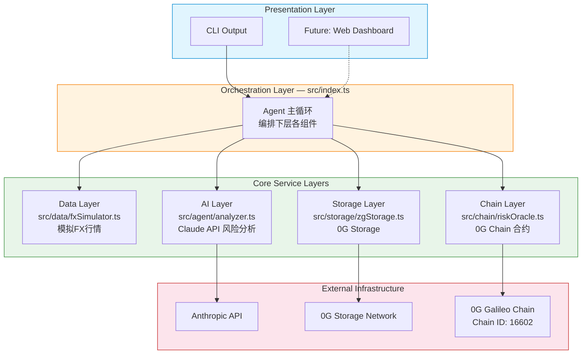
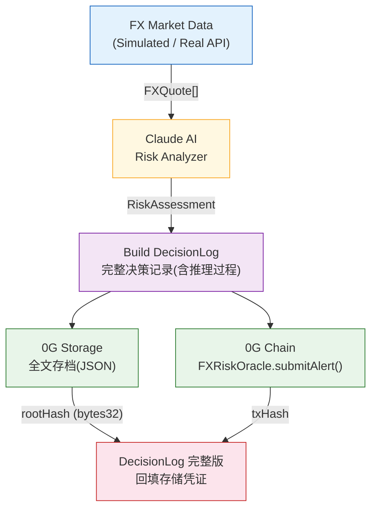
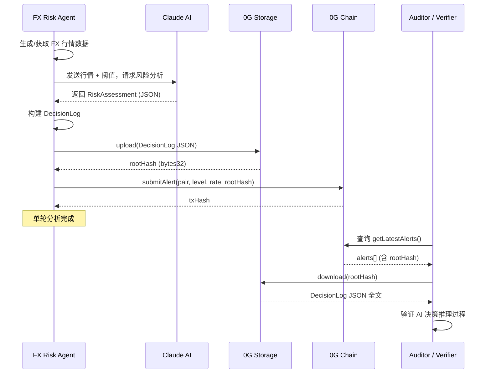
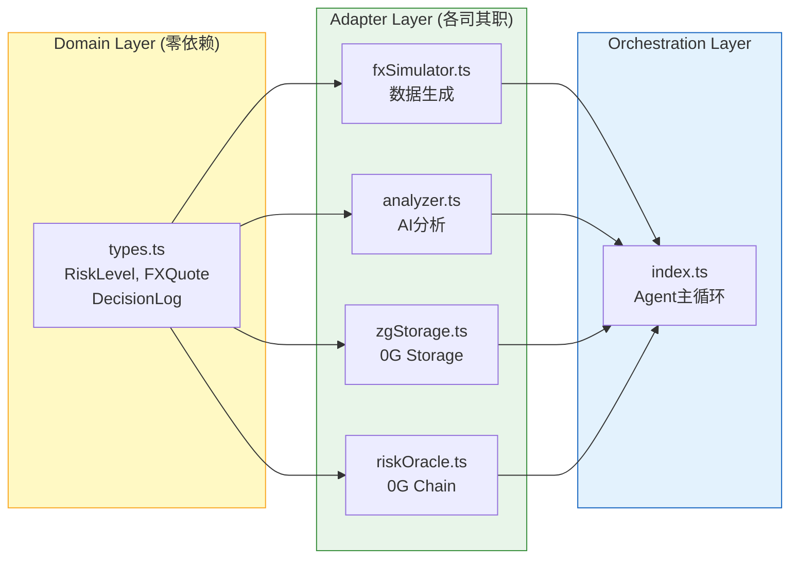
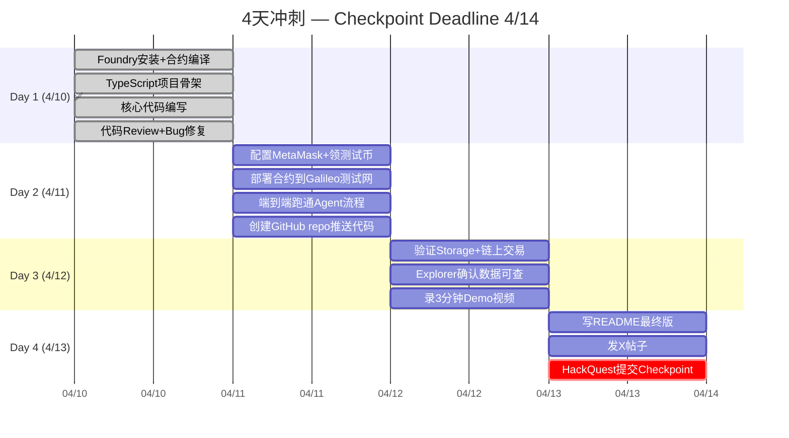
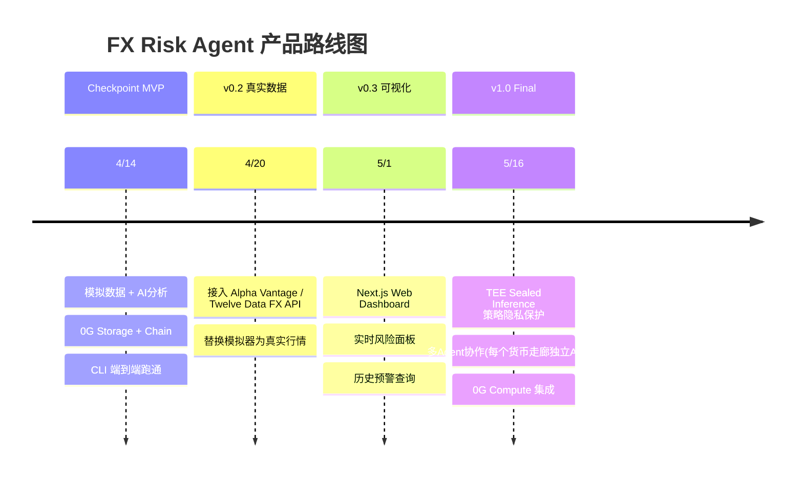
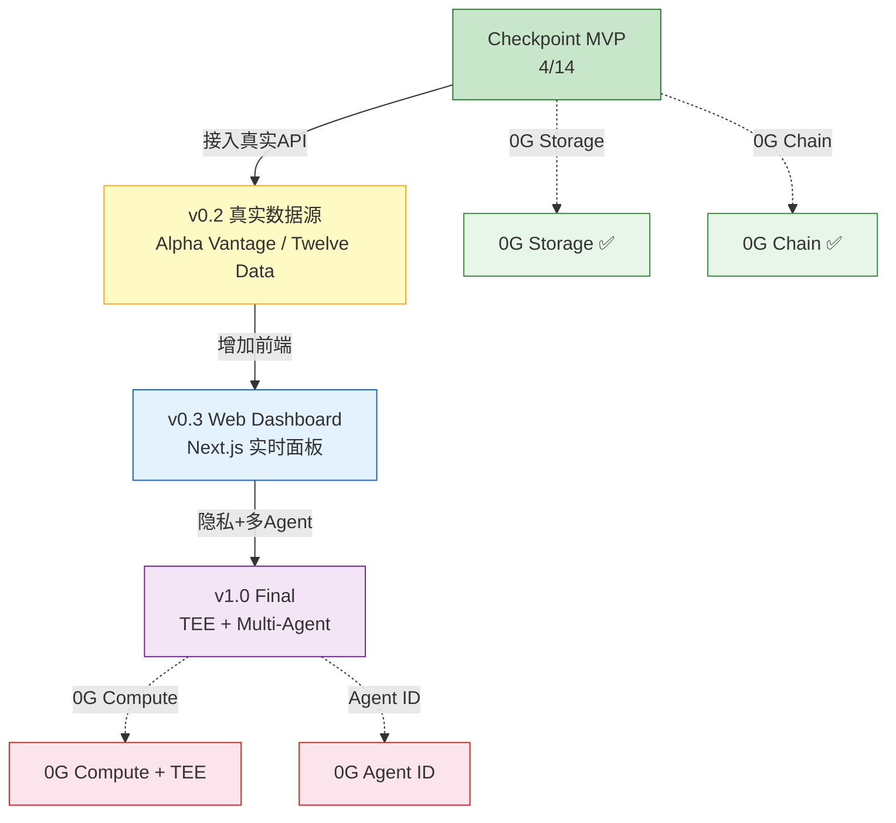
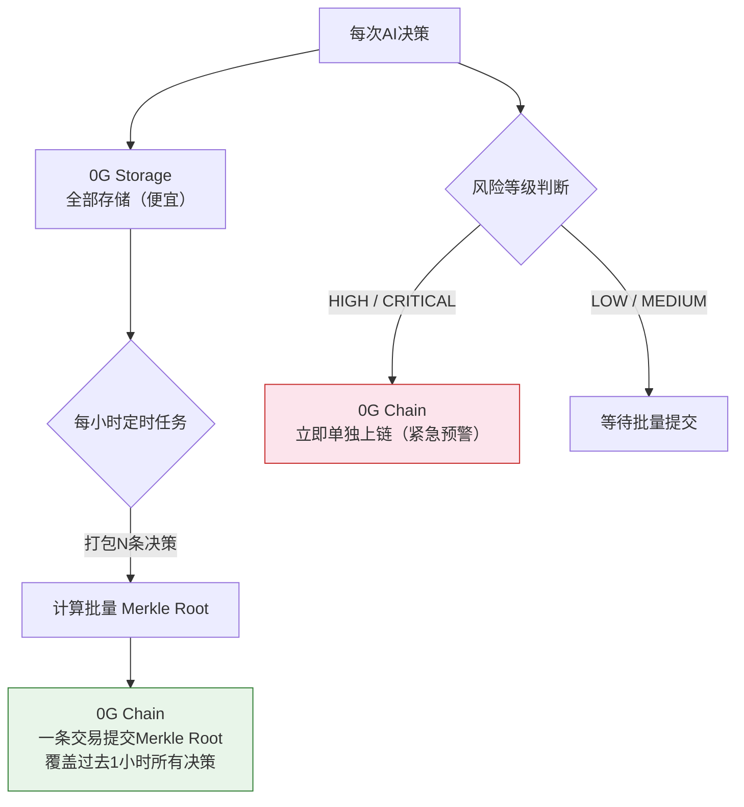
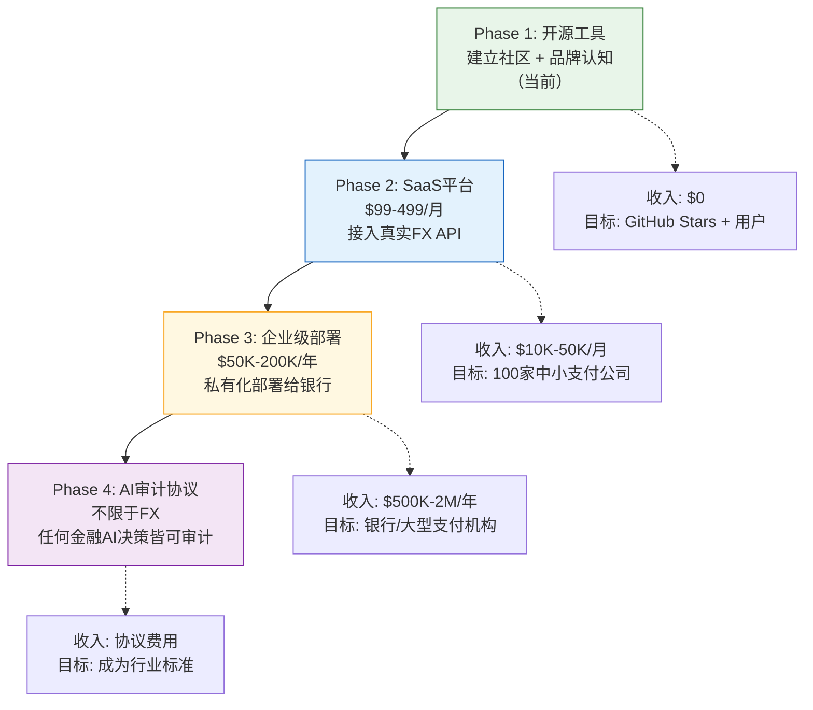

# FX Risk Agent — 技术方案

> 0G APAC Hackathon · Track 2: Agentic Trading Arena (Verifiable Finance)
> 作者: @0xSmallironman · 日期: 2026-04-10

---

## 一、项目定位

### 一句话描述
**AI驱动的外汇风险监控Agent，每一次决策都永久存储在0G Network上，可审计、可验证。**

### 解决的问题
跨境支付公司每天处理数十亿美元外汇交易。当汇率剧烈波动时：
- 人工监控漏掉关键窗口（T+0 → T+2 清算期间的敞口）
- 决策记录散落在邮件、聊天、表格中
- 事后审计缺乏**可验证的证据**证明"当时知道了什么、做了什么决定"

### 差异化优势
| 维度 | 传统方案 | FX Risk Agent |
|------|----------|---------------|
| 监控方式 | 人工盯盘 + if/else规则 | Claude AI语义分析 |
| 决策记录 | 邮件/Excel（可篡改） | 0G Storage（不可篡改） |
| 审计链路 | 无法溯源 | 链上root hash → Storage全文 |
| 隐私保护 | 无 | 未来可接入TEE Sealed Inference |

---

## 二、系统架构

### 2.1 整体架构（分层设计）



### 2.2 模块职责矩阵

| 模块 | 文件 | 职责 | 对外依赖 |
|------|------|------|----------|
| **Types** | `src/agent/types.ts` | 核心领域模型定义 | 无 |
| **Data Layer** | `src/data/fxSimulator.ts` | 生成模拟FX行情数据 | 无 |
| **AI Layer** | `src/agent/analyzer.ts` | Claude API风险分析 | Anthropic API |
| **Storage Layer** | `src/storage/zgStorage.ts` | 0G Storage上传/下载 | 0G SDK + 0G Network |
| **Chain Layer** | `src/chain/riskOracle.ts` | 链上合约交互 | ethers.js + 0G Chain |
| **Orchestration** | `src/index.ts` | 主流程编排 | 所有上层模块 |
| **Smart Contract** | `contracts/FXRiskOracle.sol` | 链上风险预警注册表 | 无 |

### 2.3 数据流



---

## 三、核心设计决策

### 3.1 为什么用Claude而不是规则引擎？

| 对比 | 规则引擎 | Claude AI |
|------|----------|-----------|
| 判断逻辑 | `if rate > 7.35` | "央行可能干预 + 技术面破位 + 地缘风险" |
| 可解释性 | 无（只有true/false） | 完整推理过程（英文，存0G） |
| 灵活性 | 改规则要改代码 | 改prompt即可 |
| 赛道匹配 | 不满足"Agentic" | 满足Track 2 AI Agent要求 |

### 3.2 为什么用0G Storage而不是IPFS？

| 对比 | IPFS | 0G Storage |
|------|------|------------|
| 与0G Chain集成 | 需要额外桥接 | 原生集成，root hash直接上链 |
| 赛道要求 | 不满足 | **必须集成至少一个0G组件** |
| 数据可用性 | pin机制，可能丢失 | 内置冗余副本 |
| SDK成熟度 | 成熟 | 可用（`@0gfoundation/0g-ts-sdk`） |

### 3.3 汇率定点数编码

合约中汇率使用 **6位小数定点数**（`uint256`）：
```
1.000000 USD = 1_000_000
7.250000 CNY = 7_250_000
152.500000 JPY = 152_500_000
```

**为什么6位**：覆盖主流FX报价精度（通常4-6位），且 `uint256` 范围远超需求。

### 3.4 风险等级定义

| Level | 值 | 触发条件 | 对应动作 |
|-------|---|----------|----------|
| LOW | 0 | 汇率在正常区间内 | 无需操作 |
| MEDIUM | 1 | 接近阈值（30%以内） | 加强监控 |
| HIGH | 2 | 突破阈值或波动率飙升 | 暂停大额交易 |
| CRITICAL | 3 | 多个指标同时触发 | 立即人工介入 |

---

## 四、技术栈

| 层级 | 技术 | 版本 | 选型理由 |
|------|------|------|----------|
| 合约语言 | Solidity | 0.8.24 | EVM标准 |
| 合约工具 | Foundry (forge) | 1.5.1 | 编译快、依赖少 |
| 业务语言 | TypeScript | 6.0 | 与0G SDK同语言 |
| AI模型 | Claude Sonnet | claude-sonnet-4-20250514 | 性价比最优，JSON输出稳定 |
| 0G SDK | @0gfoundation/0g-ts-sdk | 1.2.1 | 官方SDK |
| 链交互 | ethers.js | 6.13.1 | 0G SDK peer依赖锁定 |
| 测试网 | 0G Galileo | Chain ID 16602 | 当前活跃测试网 |

---

## 五、智能合约设计

### FXRiskOracle.sol

```solidity
// 核心数据结构
struct RiskAlert {
    string  currencyPair;    // "USD/CNY"
    RiskLevel level;         // LOW/MEDIUM/HIGH/CRITICAL
    uint256 spotRate;        // 6位定点数
    uint256 threshold;       // 触发阈值
    bytes32 storageRootHash; // 0G Storage决策日志的merkle root
    uint256 timestamp;       // 区块时间戳
    address reporter;        // Agent钱包地址
}
```

**核心函数**:
- `submitAlert()` — 写入预警（Agent调用）
- `getLatestAlerts(n)` — 查询最近n条（审计/展示）
- `latestRiskLevel(pair)` — 查某货币对当前风险等级

**设计选择**:
- 无`onlyOwner`限制 → MVP阶段简化，未来可加权限
- 用`array`存储 → 查询简单，gas可控（每条alert约50k gas）
- `storageRootHash`是关键字段 → 连接链上记录与0G Storage全文

---

## 六、0G集成方案

### 6.1 0G Storage集成

```typescript
// 上传决策日志
const memData = new MemData(jsonBytes);
const [result, err] = await indexer.upload(memData, rpcUrl, signer);
// result.rootHash → bytes32，直接写入合约
```

**数据格式**: JSON（DecisionLog完整结构）
**存储模式**: Turbo模式（通过indexer-storage-testnet-turbo端点）

### 6.2 0G Chain集成

- 合约部署在 Galileo 测试网（Chain ID: 16602）
- 通过 ethers.js 调用合约方法
- 每次submitAlert的storageRootHash字段关联0G Storage数据

### 6.3 集成验证路径



---

## 七、项目结构

```
fx-risk-agent/
├── contracts/                 # Foundry管理
│   └── FXRiskOracle.sol       # 链上风险预警合约
├── script/
│   └── Deploy.s.sol           # Foundry部署脚本
├── src/                       # TypeScript管理
│   ├── agent/
│   │   ├── types.ts           # 领域模型（RiskLevel, FXQuote, DecisionLog）
│   │   └── analyzer.ts        # Claude AI风险分析器
│   ├── data/
│   │   └── fxSimulator.ts     # FX行情模拟器
│   ├── storage/
│   │   └── zgStorage.ts       # 0G Storage客户端
│   ├── chain/
│   │   └── riskOracle.ts      # 合约交互客户端
│   └── index.ts               # Agent主流程编排
├── docs/
│   └── TECHNICAL_PROPOSAL.md  # 本文档
├── foundry.toml               # Foundry配置（src=contracts）
├── package.json               # TypeScript依赖
├── tsconfig.json
├── .env.example
└── README.md
```

### 模块依赖关系



**架构原则**:
- **关注点分离**: 每个目录对应一个独立关注点（AI/数据/存储/链）
- **依赖方向单向**: types.ts零依赖 → 各Adapter层依赖types → index.ts编排所有层
- **可替换性**: 未来替换数据源（真实API）只需改fxSimulator.ts，其他层无感知

---

## 八、执行计划



---

## 九、后续演进路线（Checkpoint → 最终提交）



### 最终提交增强方向



---

## 十、数据量与链上成本分析

### 10.1 生产环境数据量推演

| 场景 | 货币对 | 监控频率 | 日决策量 | 月决策量 |
|------|-------|---------|---------|---------|
| MVP（当前） | 4对 | 手动触发 | 4条 | — |
| 生产-保守 | 20对 | 每小时 | 480条 | 14,400条 |
| 生产-激进 | 20对 | 每15分钟 | 1,920条 | 57,600条 |

### 10.2 成本估算

| 组件 | 单条成本 | 月成本（保守） | 月成本（激进） |
|------|---------|--------------|--------------|
| 0G Storage（~5KB/条） | ~$0.001 | ~$14 | ~$58 |
| 0G Chain（~50k gas/条） | 极低 | ~$1 | ~$5 |
| AI API（豆包 Pro） | ~$0.003 | ~$43 | ~$173 |
| **合计** | | **~$58** | **~$236** |

### 10.3 生产级架构优化（V2）

当前MVP每条决策都单独上链。生产环境应采用**批量承诺模式**：



**效果**：480条决策/天 → 链上仅 24条（每小时1条Merkle Root）+ 少量紧急预警，**链上成本降低95%**。

---

## 十一、商业价值分析

### 11.1 核心定位

> **不是"存汇率的工具"，而是"AI金融决策的链上公证协议"。FX是第一个垂直场景。**

### 11.2 解决的三个真实痛点

#### 痛点1：AI合规审计（最硬的需求）

EU AI Act 2026年8月全面生效：
- 金融领域AI属于**高风险类别**，必须有完整决策审计日志
- 违规罚款：**全球营收的7%**
- 79%金融机构已在加速AI治理建设

AI治理市场规模：2025年 $4.14亿 → 2035年 $98亿（CAGR 37%）

#### 痛点2：跨境支付FX敞口管理

跨境支付市场2026年达 $2,381亿（CAGR 7.16%）。J.P. Morgan 2025报告指出：
企业更关心**可预测性**——"钱什么时候到、什么汇率、合规吗？"

#### 痛点3：AI Agent信任危机

当AI自主做金融决策时，客户和监管凭什么信任？
**答案：每个决策都有不可篡改的链上证据。**

### 11.3 商业模式



### 11.4 竞争壁垒

| 壁垒 | 说明 |
|------|------|
| **领域知识** | FIX协议 + SWIFT + 跨境清算经验，Web3圈几乎没人同时具备 |
| **先发优势** | AI+区块链审计在金融领域是空白，无直接竞品 |
| **0G生态** | 早期builder，有机会获得0G官方支持/grant |
| **合规窗口** | EU AI Act 2026.8生效，时间窗口正好 |
| **数据网络效应** | 接入的支付公司越多，跨机构风险洞察越有价值 |

---

## 十二、风险评估

| 风险 | 概率 | 影响 | 缓解措施 |
|------|------|------|----------|
| 0G Storage上传失败 | 中 | 高 | 本地备份日志，重试机制 |
| 测试币不足 | 低 | 中 | faucet每日0.1 0G，提前领取 |
| Claude API超时 | 低 | 中 | 设置30s超时，catch后跳过该货币对 |
| Galileo测试网不稳定 | 中 | 中 | 本地Anvil做开发测试 |

---

*本文档随项目迭代持续更新。*
